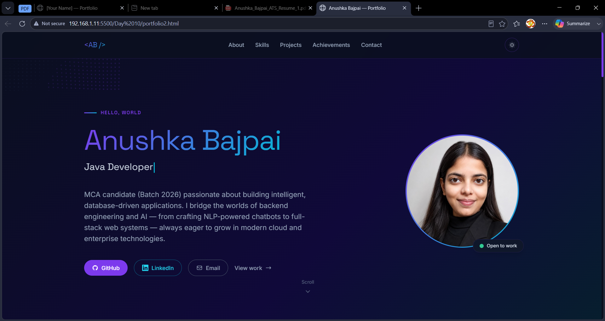

# Day 10 – Building a Developer Portfolio Website with Claude

## Objective

Create a modern and professional developer portfolio website using Claude AI to showcase skills, projects, and contact information in a visually appealing and organized format.

---

# Project Overview

Today I built a personal portfolio website that serves as a central hub for my projects, technical skills, and professional profile.

The website was designed with a modern dark-themed interface and focuses on clean navigation, responsive design, and effective project presentation.

---

## Technologies Used

* HTML
* CSS
* JavaScript
* Claude AI

---

# Portfolio Website Screenshot

---

# Portfolio Website 

`portfolio2.html`

---

# Key Sections

### Hero Section

* Professional introduction
* Developer profile
* Call-to-action buttons

### About Me

* Brief personal introduction
* Educational background
* Career goals

### Skills Section

* Programming languages
* Web development technologies
* Technical skill indicators

### Projects Showcase

Featured projects included
