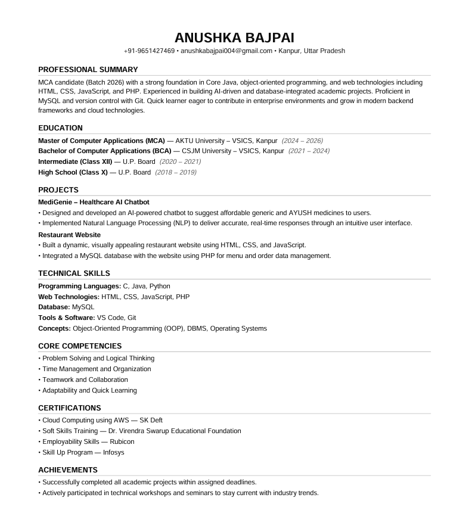
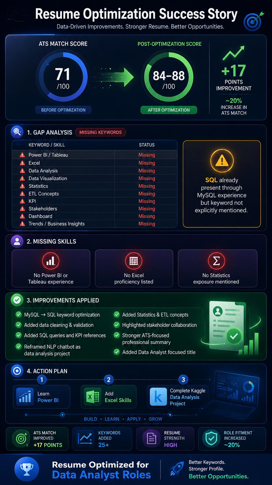
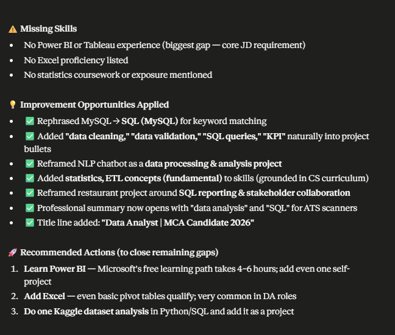
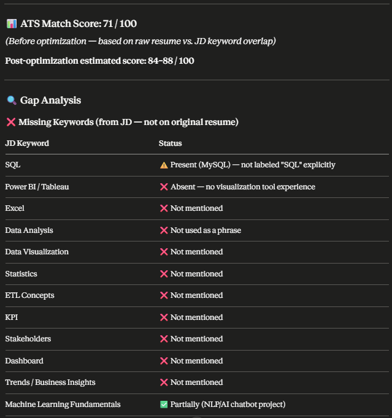
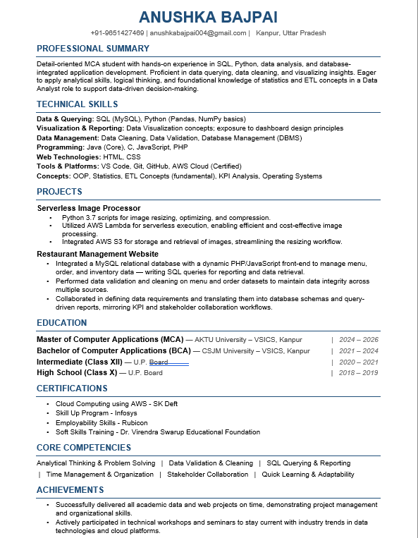

# Day 11 – ATS Resume Optimization with AI

## Objective

Analyze my resume against a Data Analyst job description, identify ATS gaps, optimize keyword alignment, and improve overall ATS compatibility.

---

## ATS Analysis Summary

### ATS Match Score

| Category | Score |
|-----------|---------|
| Initial ATS Match | 71/100 |
| Post-Optimization ATS Match | 84–88/100 |
| Improvement | +17 Points |

### Key Insight

ATS systems rely heavily on keyword matching. Relevant skills and experience may be overlooked if industry-standard terminology is not explicitly mentioned.

---

## Resume Screenshot

### Original Resume

---

### ATS Analysis Dashboard

---

### Gap Analysis Report

---

### Optimized Resume

---

## Gap Analysis

### Missing Keywords Identified

| Keyword / Skill | Status |
|----------------|---------|
| Power BI / Tableau | Missing |
| Excel | Missing |
| Data Analysis | Missing |
| Data Visualization | Missing |
| Statistics | Missing |
| ETL Concepts | Missing |
| KPI | Missing |
| Stakeholders | Missing |
| Dashboard | Missing |
| Trends / Business Insights | Missing |

### Observation

> SQL knowledge was already present through MySQL experience, but the keyword "SQL" was not explicitly highlighted, reducing ATS visibility.

---

## Missing Skills

### Critical Gaps

- Power BI / Tableau experience not listed
- Excel proficiency not mentioned
- Statistics knowledge not mentioned

---

## Resume Improvements Applied

### Keyword Optimization

- MySQL → SQL keyword optimization
- Added Data Cleaning and Validation
- Added KPI references
- Added Business Insight terminology
- Added ETL Concepts
- Added Statistics keyword

### Experience Enhancement

- Reframed NLP Chatbot project from an application-focused project to a data-analysis-oriented project
- Highlighted analytical thinking and problem-solving
- Added stakeholder collaboration references

### Profile Enhancement

- Improved ATS-focused Professional Summary
- Added Data Analyst focused positioning
- Increased keyword coverage across projects and skills sections

---

## Action Plan

### Short-Term Goals

#### 1. Learn Power BI

- Dashboard creation
- Data modeling
- Visual analytics

#### 2. Improve Excel Skills

- Pivot Tables
- Lookup Functions
- Data Cleaning
- Charts and Reporting

#### 3. Build a Data Analytics Project

Recommended:

- Kaggle Dataset Analysis
- Business Dashboard Project
- Data Visualization Portfolio Project

---

## Results

### Before Optimization

- ATS Score: 71/100
- Missing multiple Data Analyst keywords
- Lower recruiter discoverability

### After Optimization

- ATS Score: 84–88/100
- Stronger keyword alignment
- Improved recruiter visibility
- Better fit for Data Analyst roles

---

## Key Learnings

### Learning #1

ATS optimization is not about stuffing keywords; it is about accurately describing skills using industry-recognized terminology.

### Learning #2

Even relevant experience may be ignored if expected keywords are missing.

### Learning #3

Project descriptions can significantly impact ATS performance when framed around business outcomes and analytical skills.

### Learning #4

AI can quickly identify keyword gaps and suggest improvements while maintaining authenticity.

### Learning #5

Resume optimization should be an ongoing process tailored to each target role.

---

## Tools Used

- Claude AI
- ATS Resume Analysis
- Gap Analysis Framework
- Resume Optimization Techniques

---

## Day 11 Reflection

Today I learned that ATS optimization goes beyond formatting. The real impact comes from aligning experience, skills, and project descriptions with the language recruiters and hiring systems use. Small keyword improvements can lead to significantly better resume visibility and interview opportunities.

---
