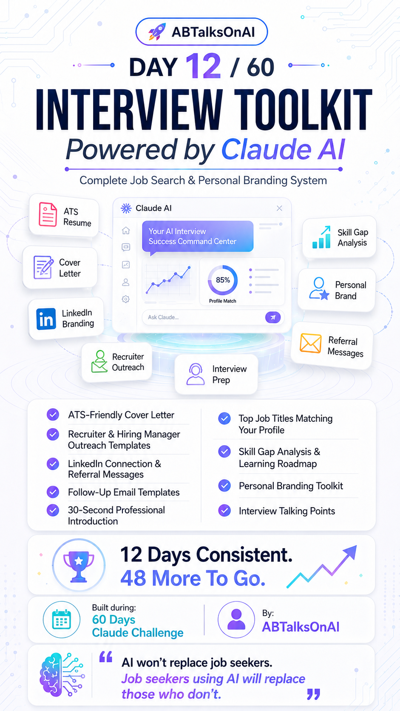
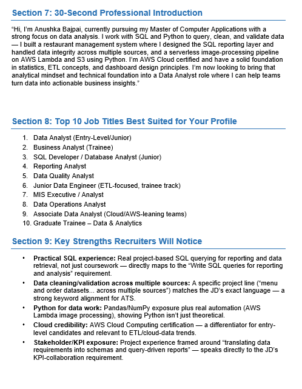
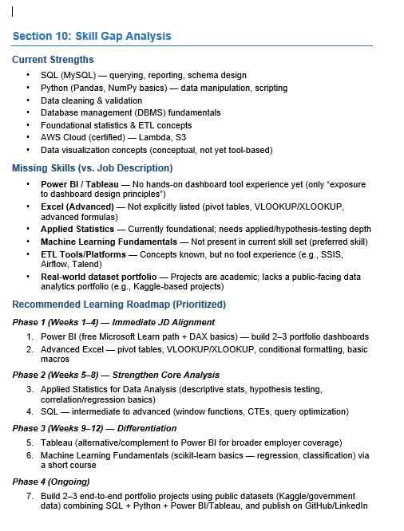
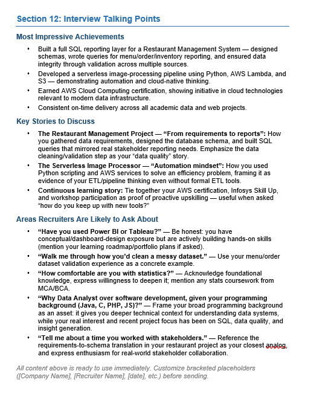

# Day 12 of 60 Days of Claude Challenge

## AI-Powered Interview Toolkit

### Overview

For Day 12 of the 60 Days of Claude Challenge, I built a comprehensive Interview Toolkit designed to help job seekers streamline their job application process, improve personal branding, and prepare confidently for interviews.

Using Claude AI, I generated multiple career-focused assets that cover the entire job search journey—from resume optimization to recruiter outreach and interview preparation.

---

# Project Objective

To create an AI-powered toolkit that assists job seekers with:

* Job Application Materials
* Personal Branding
* Networking & Outreach
* Interview Preparation
* Skill Gap Analysis
* Career Planning

---

# Generated Job Application Assets

## ATS-Friendly Cover Letter

Claude generated customized cover letters optimized for Applicant Tracking Systems (ATS), ensuring relevant keywords and professional formatting.

### Key Benefits

* ATS optimized structure
* Job-specific customization
* Professional language
* Improved recruiter visibility

---

## Recruiter Outreach Templates

Professional message templates designed for contacting recruiters and hiring managers.

### Included Templates

* LinkedIn Recruiter Outreach
* Hiring Manager Introduction
* Cold Outreach Message
* Networking Follow-Up

---

## Follow-Up Email Templates

AI-generated follow-up emails for:

* Job Applications
* Interview Follow-Ups
* Networking Conversations
* Recruiter Communications

---

## LinkedIn Connection & Referral Messages

Personalized connection requests and referral request templates.

### Examples

* New Connection Request
* Referral Request
* Alumni Networking Message
* Recruiter Engagement Message

---

# Personal Branding Outputs

## Professional Introduction

Claude generated a concise 30-second professional introduction suitable for:

* Interviews
* Networking Events
* Recruiter Calls
* Career Fairs

---

## Personal Branding Toolkit

Generated recommendations for:

* LinkedIn Headline
* About Section
* Featured Content
* Profile Optimization
* Professional Positioning

---

## Top Job Title Recommendations

Based on profile analysis, Claude suggested suitable job roles aligned with skills and career goals.

### Sample Roles

* Software Developer
* Full Stack Developer
* Frontend Developer
* Backend Developer
* Web Developer
* Associate Software Engineer

---

# Skill Gap Analysis

Claude analyzed current skills and identified areas for improvement.

### Recommended Learning Areas

* Data Structures & Algorithms
* System Design Fundamentals
* Modern JavaScript
* React Development
* Backend Development
* Database Optimization
* Cloud Fundamentals

---

# Learning Roadmap

A structured roadmap was generated to bridge identified skill gaps.

### Roadmap Includes

* Beginner Concepts
* Intermediate Development Skills
* Advanced Engineering Topics
* Project-Based Learning
* Interview Preparation Strategy

---

# Interview Preparation Assets

## Interview Talking Points

Generated discussion points for:

* Self Introduction
* Project Explanation
* Technical Skills
* Problem Solving
* Career Goals

---

## Interview Readiness Support

Claude helped prepare:

* Behavioral Questions
* Technical Discussions
* STAR Method Responses
* Strength & Weakness Answers

---

# Screenshots

## Dashboard SS

---
## Sections SS

---

---

---

# Key Learnings

### 1. AI Can Streamline Job Search Activities

Claude significantly reduces the time spent creating resumes, cover letters, outreach messages, and follow-up emails.

### 2. Personal Branding Matters

A strong LinkedIn profile and professional positioning can increase visibility among recruiters.

### 3. Targeted Communication Improves Results

Customized recruiter messages and referral requests are more effective than generic templates.

### 4. Skill Gap Awareness Is Critical

Understanding missing skills helps create focused learning plans and accelerates career growth.

### 5. AI Is a Career Accelerator

AI tools like Claude can enhance productivity, improve communication, and support interview preparation.

---

# Conclusion

Day 12 demonstrated how AI can be leveraged to build a complete career support system for job seekers.

By combining job application assets, personal branding guidance, networking support, and interview preparation into a single toolkit, Claude AI becomes a valuable career companion throughout the job search journey.

---

## Challenge Progress

✅ Day 12 Completed

🎯 48 Days Remaining

