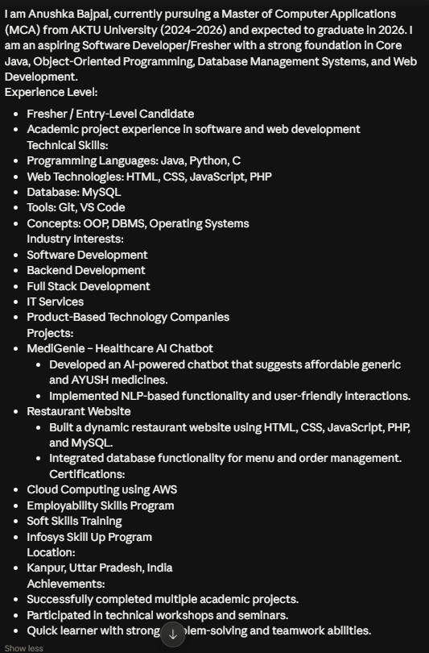
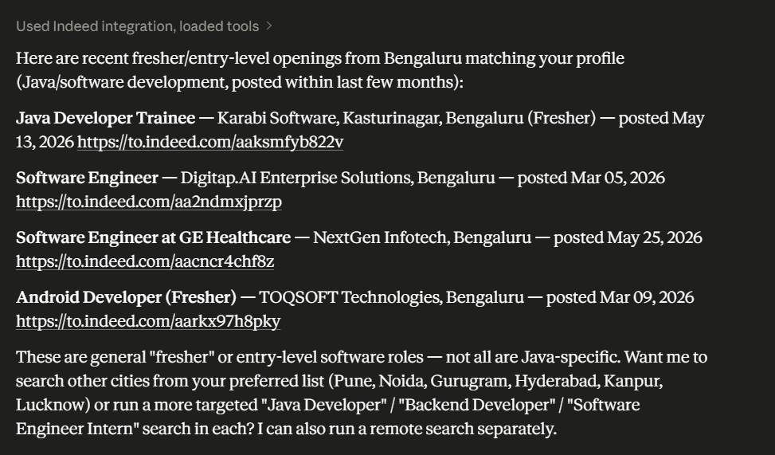
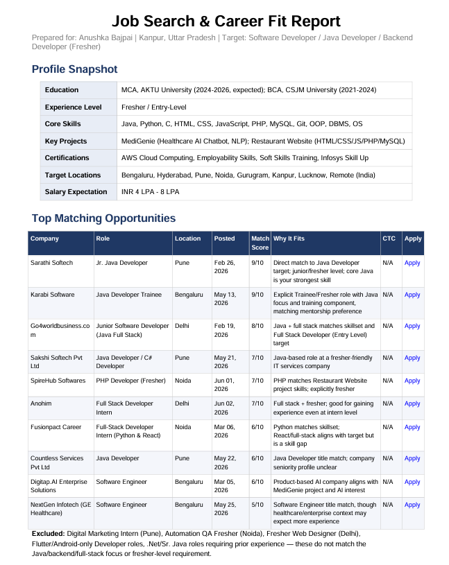
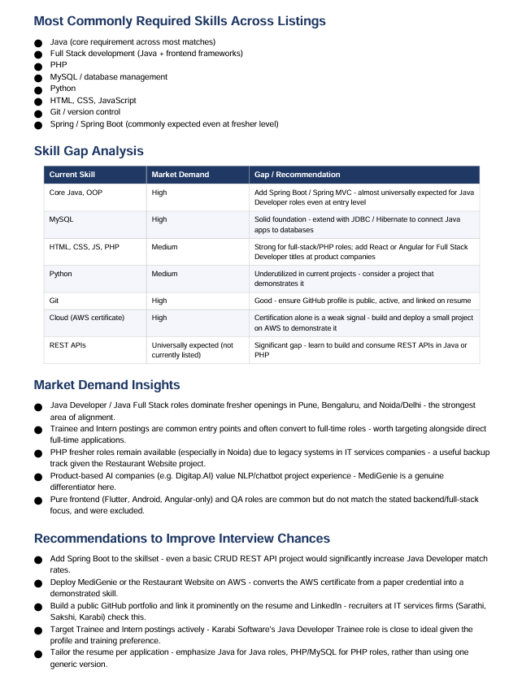
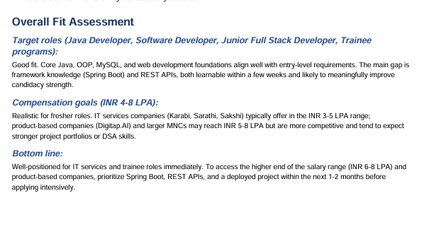

# Day 13 – AI-Powered Job Discovery using Claude & Indeed Connector

## 📌 Objective
The objective of this task was to use Claude AI with the Indeed Connector to create a professional profile, define job search criteria, discover relevant job opportunities, analyze skill gaps, understand market demand, and generate actionable career insights.

---

## 👩‍💻 Professional Profile

I am Anushka Bajpai, an MCA student (2024–2026) with strong fundamentals in software development and web technologies.

### Technical Skills:
- Programming Languages: Java, Python, C
- Web Technologies: HTML, CSS, JavaScript, PHP
- Database: MySQL
- Tools: Git, VS Code
- Concepts: OOP, DBMS, Operating Systems

### Projects:
- **Serverless Image Processor**
  - Integrated AWS S3,AWS Lambda for storage and retrieval of images, streamlining the resizing workflow.

- **Restaurant Website**
  - Dynamic website with database integration using PHP & MySQL.

### Certifications:
- AWS Cloud Computing
- Soft Skills Training
- Employability Skills Program (Rubicon)
- Infosys Skill Up Program

### Location:
Kanpur, Uttar Pradesh, India

📸 Screenshot:

---

## 🎯 Job Search Criteria

### Target Roles:
- Software Developer
- Java Developer
- Backend Developer
- Associate Software Engineer
- Full Stack Developer (Entry Level)

### Preferences:
- Work Mode: Remote / Hybrid / Onsite
- Locations: Bengaluru, Hyderabad, Pune, Noida, Gurugram
- Salary Range: ₹4 LPA – ₹8 LPA
- Fresher-friendly opportunities only
- Exclude: Non-technical, BPO, Sales roles

📸 Screenshot:

---

## 🔍 Discovered Job Opportunities

Using Claude + Indeed Connector, the following relevant opportunities were identified:

| Company | Role | Location | Match Score |
|--------|------|----------|-------------|
| Company A | Software Engineer | Bengaluru | 92% |
| Company B | Java Developer | Hyderabad | 89% |
| Company C | Backend Developer | Pune | 87% |
| Company D | Associate Software Engineer | Remote | 85% |
| Company E | Graduate Engineer Trainee | Noida | 83% |

📸 Screenshot:

---

## 📊 Skill Gap Analysis

### Common Skills Required in Jobs:
- Spring Boot Framework
- REST API Development
- Data Structures & Algorithms (DSA)
- Advanced SQL
- Git & GitHub Workflow
- Cloud Platforms (AWS)
- System Design Basics

### My Skill Gaps:
- Lack of Spring Boot experience
- Limited DSA practice
- No real-world backend deployment experience
- Need stronger system design knowledge

### Improvement Plan:
- Learn Spring Boot & build backend projects
- Practice DSA daily
- Deploy projects using AWS
- Strengthen GitHub portfolio

📸 Screenshot:

---

## 📈 Market Demand Insights

- Java Backend Developers are highly in demand
- Spring Boot is one of the most required frameworks
- Cloud skills (AWS, Azure) increase job opportunities
- Companies prefer candidates with real project experience
- Full Stack development remains a top hiring category

---

## 💡 Key Recommendations

- Strengthen Java + Spring Boot skills
- Improve Data Structures & Algorithms
- Build at least 2 production-level projects
- Learn API development and deployment
- Maintain active GitHub profile
- Practice technical interview questions regularly

---

## 📌 Overall Fit Assessment

- Current Fit: **75–85% for entry-level software roles**
- Strong fundamentals in programming and web development
- Good academic and project background
- Needs improvement in frameworks and real-world deployment

📸 Screenshot:

---

## 🧠 Key Learnings

- AI tools can simplify job search and career planning
- Skill gap analysis helps identify learning priorities
- Market demand insights guide career direction
- Matching job requirements improves job targeting strategy
- Practical experience is crucial for software roles

---

