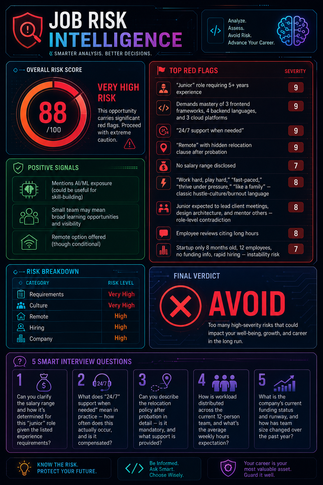
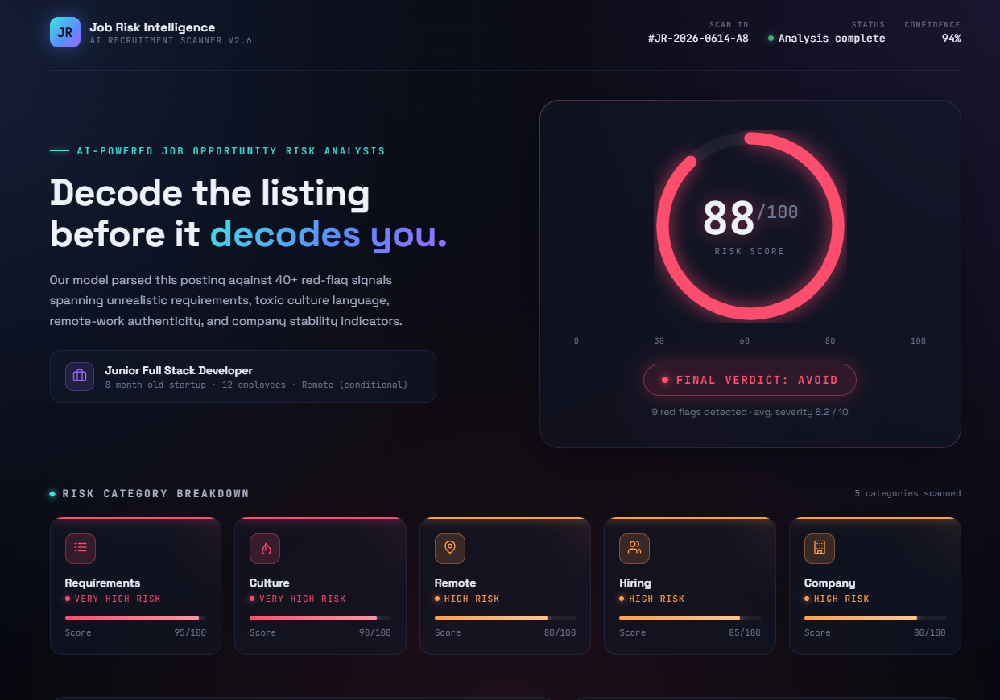
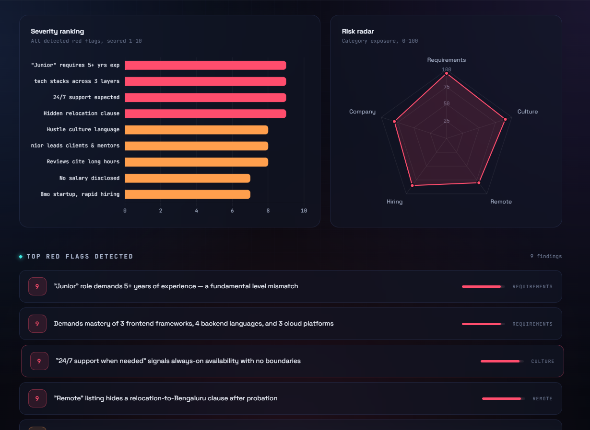
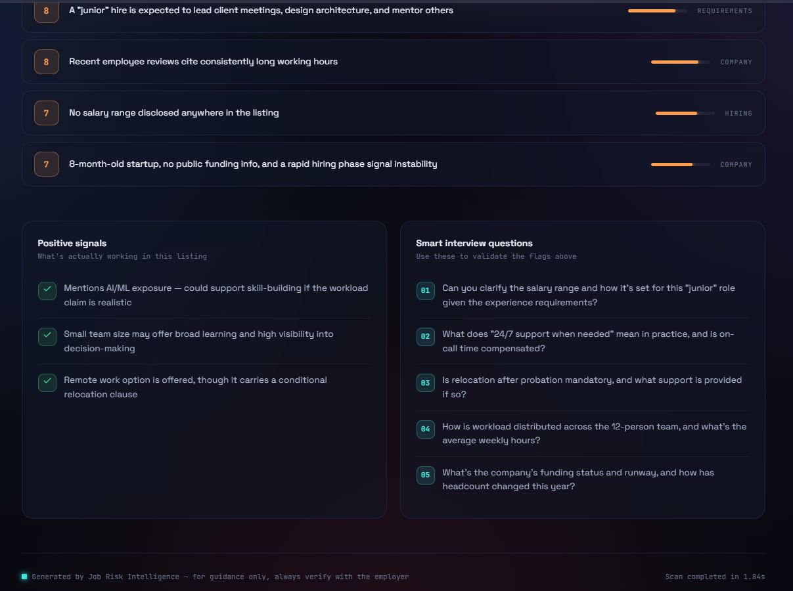

# Day 14 – Job Risk Intelligence Dashboard

## 🚀 Project Overview

Today I built **Job Risk Intelligence**, an AI-powered dashboard that analyzes job descriptions and identifies potential risks before candidates invest their time in lengthy application processes.

The platform evaluates job postings across multiple dimensions including requirements, company culture, hiring practices, remote-work authenticity, and organizational stability.

---

## 🎯 Problem Statement

Many job seekers apply to positions without realizing:

* Requirements are unrealistic for the advertised role
* Remote opportunities may contain hidden relocation clauses
* Company culture may promote burnout
* Salary transparency is missing
* Early-stage companies may have instability risks

This dashboard helps candidates make more informed career decisions.

---

## 🛠 Features

### Risk Analysis Engine

* Overall Job Risk Score Generation
* Category-wise Risk Assessment
* Red Flag Detection
* Severity Ranking System

### Opportunity Evaluation

* Requirement Analysis
* Company Stability Review
* Hiring Transparency Assessment
* Remote Work Verification

### Candidate Assistance

* Smart Interview Question Generator
* Positive Signal Identification
* Actionable Insights Dashboard

---

## 📊 Risk Analysis Report

### Overall Risk Score

**88 / 100**

### Final Verdict

❌ **AVOID**

### Risk Breakdown

| Category     | Risk Level |
| ------------ | ---------- |
| Requirements | Very High  |
| Culture      | Very High  |
| Remote       | High       |
| Hiring       | High       |
| Company      | High       |

---

## 🚩 Top Red Flags Detected

### Severity 9

* Junior role requiring 5+ years of experience
* Demands mastery of multiple frontend frameworks, backend languages, and cloud platforms
* "24/7 support when needed" expectation
* Remote position containing hidden relocation requirement

### Severity 8

* Hustle-culture language such as:

  * Work hard, play hard
  * Fast-paced environment
  * Thrive under pressure
  * Like a family

* Junior employee expected to:

  * Lead client meetings
  * Design architecture
  * Mentor team members

* Employee reviews mentioning long working hours

### Severity 7

* No salary range disclosed
* Startup only 8 months old with limited public information and rapid hiring

---

## ✅ Positive Signals

Although the opportunity showed significant risk indicators, some positive aspects were identified:

* AI/ML exposure opportunities
* Broad learning potential in a small team
* Remote work option available (with conditions)

---

## 💡 Smart Interview Questions Generated

1. Can you clarify the salary range and how compensation is determined for this role?

2. What does "24/7 support when needed" mean in practice, and is this time compensated?

3. Is relocation after probation mandatory, and what support is provided?

4. How is workload distributed across the current team, and what are the expected weekly working hours?

5. What is the company's funding status and future runway?

---

## 🖼 Screenshots

### Dashboard Overview

### Risk Analysis Results

### Red Flag Detection Panel

---

## 🧠 Key Learnings

### Technical Learnings

* Designing analytics-focused dashboards
* Visualizing risk data effectively
* Creating structured scoring systems
* Improving information hierarchy
* Building futuristic UI layouts

### Product Learnings

* AI can support career decision-making
* Transparency is a major factor in job evaluation
* Data visualization improves insight consumption
* User-centric reporting creates actionable outcomes

### Personal Learnings

* Building complete projects improves learning speed
* Consistency compounds over time
* AI tools accelerate prototyping and experimentation
* Shipping projects publicly increases accountability

---

