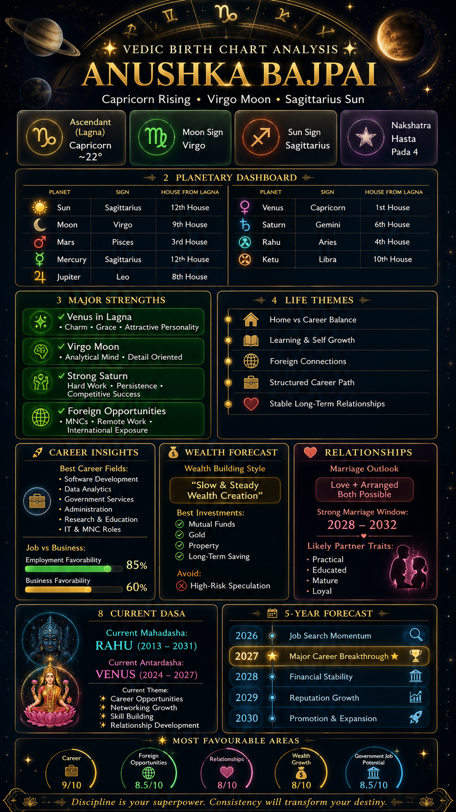
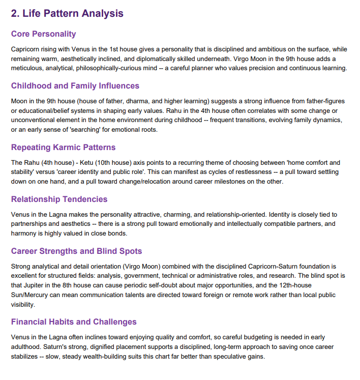
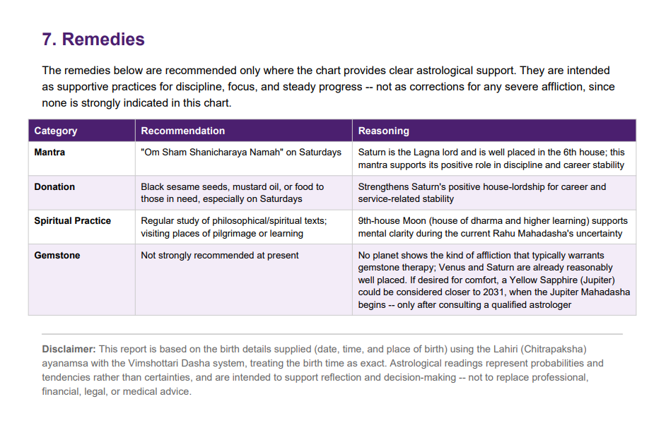
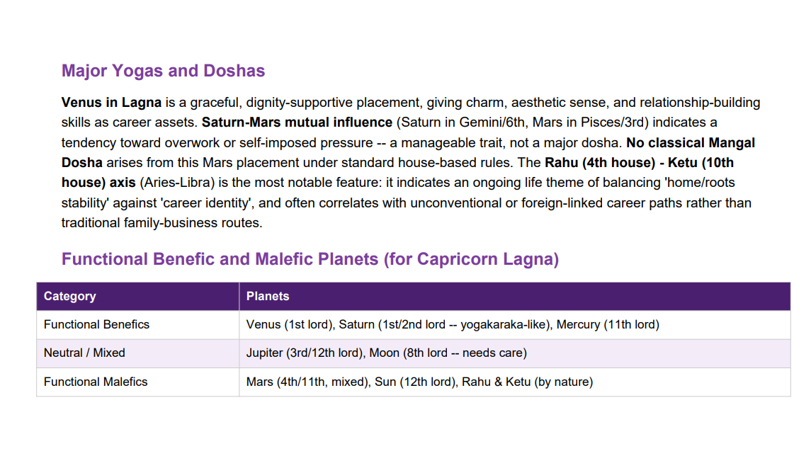

# Day 15 – AI-Powered Vedic Birth Chart Analysis

## Overview

As part of Day 15 of the 60-Day AI Challenge, I explored how Claude can be used to generate detailed Vedic astrology reports from birth details and planetary calculations.

The project focused on transforming complex astrological data into a visually appealing and easy-to-understand infographic dashboard.

---

# Project Objectives

* Generate a complete Vedic birth chart analysis
* Analyze planetary placements and house positions
* Interpret career, wealth, relationship, and health indicators
* Create a premium infographic-style astrology dashboard
* Explore how AI can convert structured data into personalized insights

---

# Generated Reports

## Birth Chart Summary

### Ascendant (Lagna)

* Capricorn

### Moon Sign

* Virgo

### Sun Sign

* Sagittarius

### Nakshatra

* Hasta Pada 4

### Current Mahadasha

* Rahu Mahadasha

---

## Key Areas Analyzed

### Personality Analysis

* Disciplined and ambitious mindset
* Strong analytical abilities
* Practical decision-making approach
* Detail-oriented thinking

### Career Insights

* Government sector suitability
* IT and technology career alignment
* Foreign company opportunities
* Strong service and management potential

### Wealth Analysis

* Gradual and stable financial growth
* Long-term wealth accumulation
* Better returns through disciplined investing
* Property prospects in later years

### Relationship Analysis

* Strong emotional loyalty
* Preference for meaningful connections
* Stable long-term partnership indicators
* Balanced love and arranged marriage possibilities

### Health Analysis

* Stress management is important
* Focus on digestive health
* Importance of sleep and routine
* Benefits from meditation and mindfulness

---

# Infographic Dashboard Features

The generated dashboard included:

* Zodiac Visualization
* Planetary Placement Table
* Career Potential Score
* Wealth Potential Score
* Relationship Analysis
* Health & Wellness Insights
* Spiritual Growth Indicators
* Career Growth Timeline
* Five-Year Forecast
* Personalized Recommendations

---

# Screenshots

Premium Vedic Astrology Dashboard

Features:

* Dark luxury theme
* Gold accents
* Astrology visualization
* Interactive infographic layout

(Add generated dashboard screenshot here)

---

# Observations

### What Worked Well

* AI successfully converted raw birth data into structured insights.
* Complex astrological concepts became easier to understand.
* Visual storytelling improved engagement.
* Infographic presentation enhanced readability.

### Challenges

* Birth-time accuracy significantly affects chart precision.
* Multiple astrological interpretations can exist.
* Visual information hierarchy required careful design.

---

# Key Learnings

1. AI can transform large datasets into personalized reports.
2. Prompt engineering plays a crucial role in report quality.
3. Information visualization greatly improves user understanding.
4. Structured storytelling makes technical concepts accessible.
5. Combining AI with design tools creates highly engaging outputs.

---

# Future Improvements

* Interactive web-based astrology dashboard
* PDF report generation
* Automated horoscope generation
* Personalized recommendation engine
* Multi-language support
* Mobile-friendly astrology application

---

# Conclusion

This project demonstrated how AI can bridge traditional knowledge systems and modern technology. By combining data analysis, prompt engineering, and visual design, it is possible to create detailed, user-friendly astrology reports that are both informative and visually engaging.

---

*"The real power of AI lies in making complex information simple, personalized, and actionable."*
