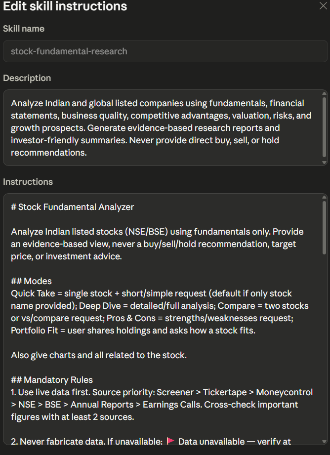
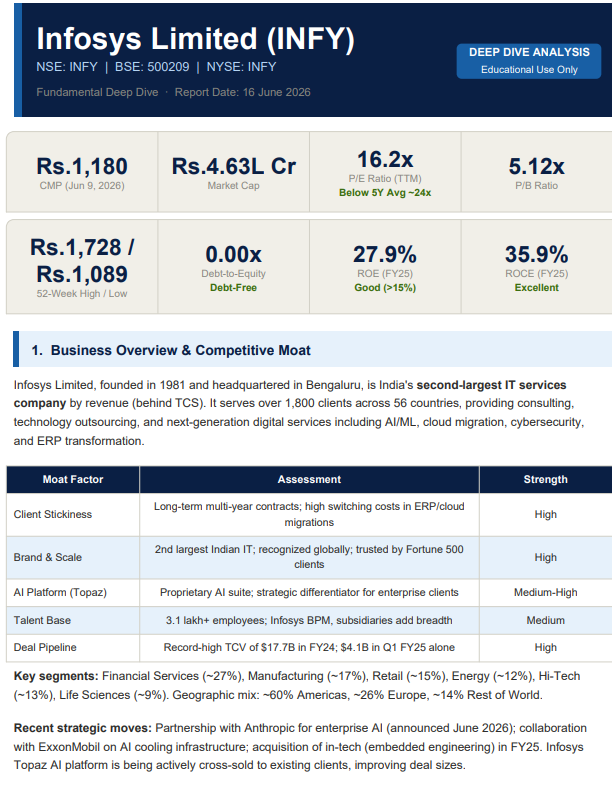
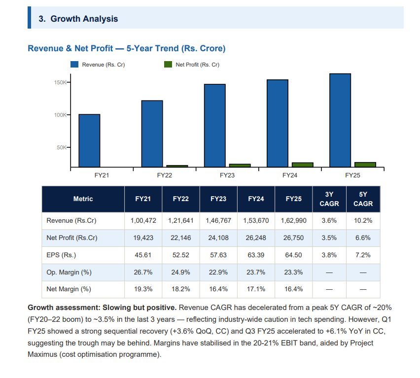
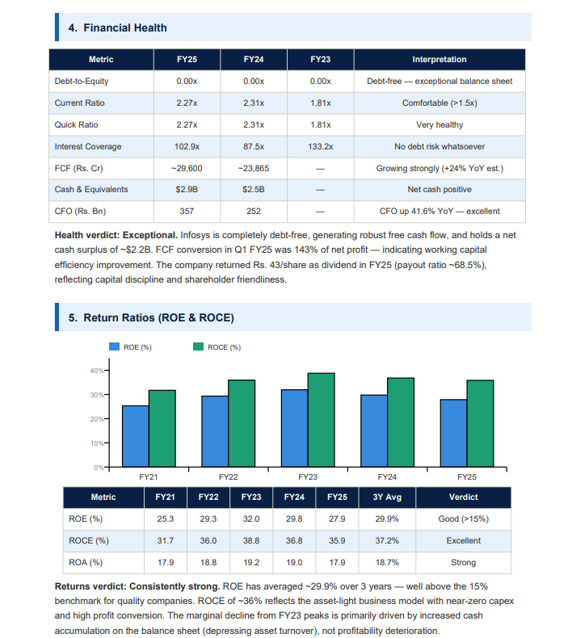
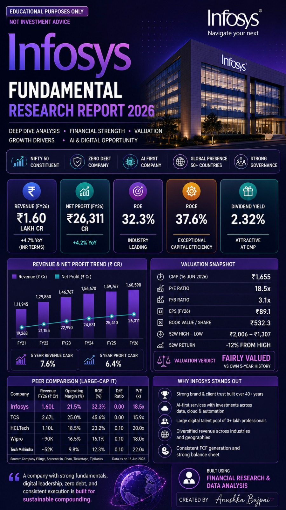

# Day 16 - AI-Powered Stock Fundamental Research using Claude Custom Skills

## Overview

This project demonstrates the creation and testing of a reusable Claude Custom Skill named **stock-fundamental-research**. The skill was designed to analyze listed companies using financial statements, business fundamentals, valuation metrics, competitive advantages, growth opportunities, and risk factors.

The objective was to create a structured AI-powered workflow that can generate consistent research reports without repeatedly entering lengthy prompts.

---

## Custom Skill Details

### Skill Name

**stock-fundamental-research**

### Description

Analyze Indian and global listed companies using fundamentals, financial statements, business quality, competitive advantages, valuation, risks, and growth prospects.

Generate evidence-based research reports and investor-friendly summaries.

**Note:** The skill does not provide direct buy, sell, or hold recommendations.

---

## Project Workflow

1. Created a new Claude Custom Skill.
2. Configured the skill name and description.
3. Added detailed stock research instructions.
4. Saved and activated the custom skill.
5. Tested the skill on Infosys Ltd.
6. Generated a comprehensive fundamental research report.
7. Reviewed financial metrics, valuation, and growth prospects.
8. Captured screenshots of the skill configuration and generated report.
9. Documented observations and learnings.

---

## Screenshots

### 1. Custom Skill Setup

---

### 2. Infosys Fundamental Research Report

---

### 3. Financial & Valuation Analysis

---

## Report Highlights

### Company Analyzed

**Infosys Limited**

### Areas Covered

* Business Overview
* Financial Performance
* Revenue Growth Analysis
* Profitability Trends
* ROE Analysis
* ROCE Analysis
* Valuation Metrics
* Competitive Positioning
* Growth Drivers
* Risk Assessment
* Investor-Friendly Summary

---

## Key Observations

### Strengths

* Strong brand presence in global IT services.
* Debt-free balance sheet.
* Consistent cash flow generation.
* Significant investments in AI and digital transformation.
* Diversified customer base across industries and geographies.

### Growth Drivers

* AI and Automation Services
* Cloud Transformation Projects
* Enterprise Digitalization
* Global Technology Spending Growth

### Risks Identified

* Slowdown in global IT spending.
* Currency fluctuations.
* Competitive pressure from large IT service providers.
* Dependence on enterprise technology budgets.

---

## Key Learnings

### Technical Learnings

* Learned how to build reusable AI workflows using Claude Custom Skills.
* Understood prompt engineering for domain-specific tasks.
* Learned how AI can automate structured financial analysis.

### Financial Learnings

* Improved understanding of valuation metrics such as P/E Ratio and P/B Ratio.
* Learned how ROE and ROCE help evaluate business quality.
* Understood how revenue growth, profitability, and capital efficiency impact company analysis.

### Productivity Learnings

* Custom Skills eliminate repetitive prompting.
* Standardized workflows improve consistency and efficiency.
* AI can function as a specialized research assistant when given structured instructions.

---

## Tools Used

* Claude AI
* Claude Custom Skills
* Financial Research Framework
* Fundamental Analysis Methodology

---

## Disclaimer

This project was created solely for educational and research purposes.

The generated report does not constitute financial, investment, trading, or advisory recommendations.

Always perform independent research before making investment decisions.

---