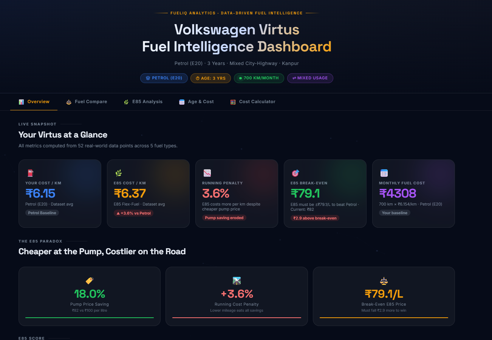
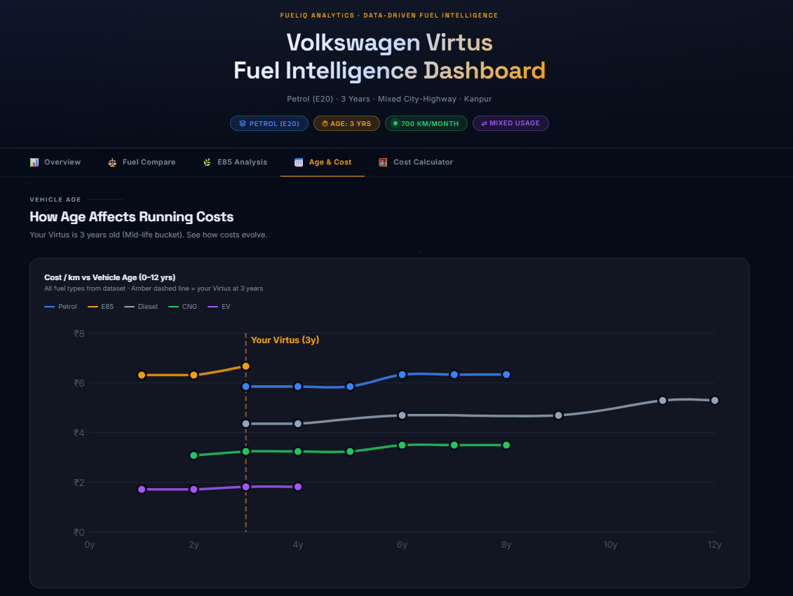
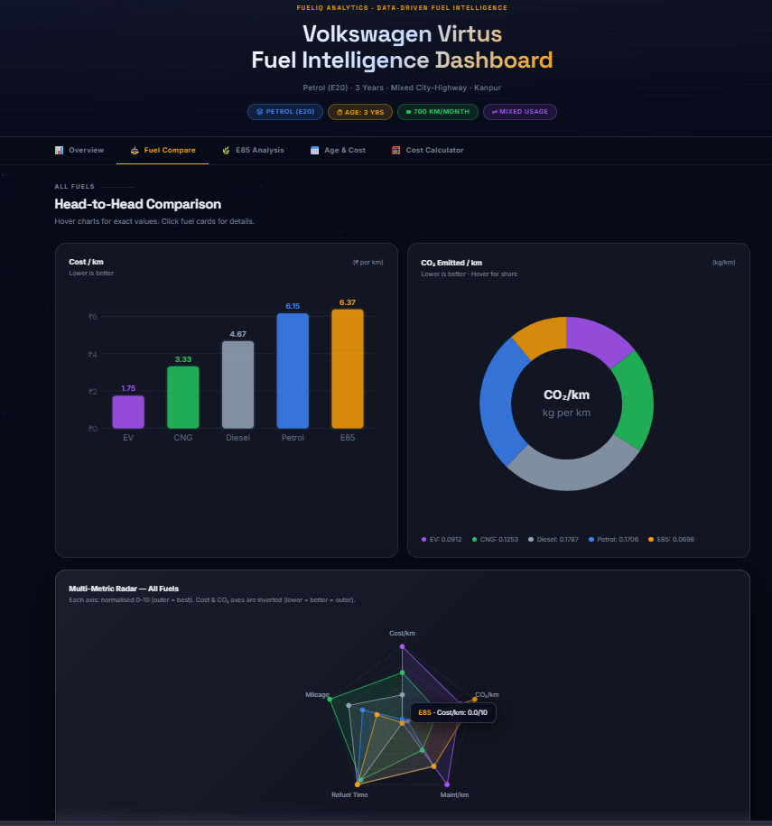
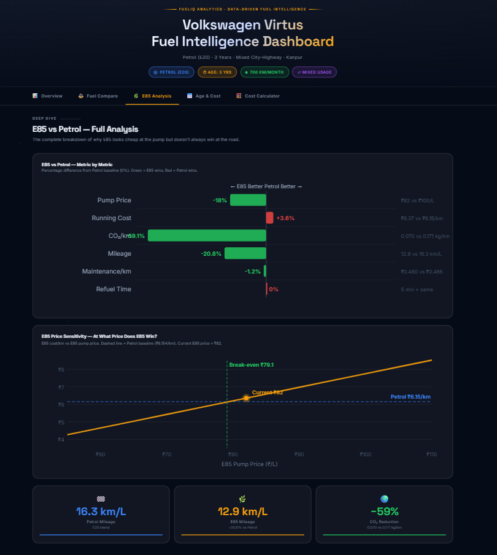

# Fuel Intelligence Dashboard Analysis

## Project Overview

This project focuses on building an interactive **Fuel Intelligence Dashboard** to compare different fuel options for a vehicle based on cost, efficiency, maintenance, emissions, and long-term ownership impact.

The objective was to move beyond simple fuel price comparisons and develop a data-driven decision support system that helps users identify the most economical and sustainable fuel choice.

---

# Dashboard Screenshots

## Main Dashboard



## Cost Analysis Section



## Emissions & Sustainability Analysis



## Fuel Intelligence Score



---

# Generated HTML Dashboard

The project dashboard was developed using:

* HTML5
* CSS3
* JavaScript
* Canvas API
* Interactive Data Visualizations

### Files Included

```text
fuel_intelligence_dashboard.html
styles.css
script.js
dataset.csv
README.md
```

The dashboard provides real-time interaction, responsive layouts, visual analytics, and actionable insights.

---

# Dataset Overview

The dataset contains information about multiple fuel types:

* Petrol
* E85
* Diesel
* CNG
* EV

Parameters analyzed:

| Parameter           | Description                        |
| ------------------- | ---------------------------------- |
| Fuel Price          | Cost per litre/unit                |
| Mileage             | Distance covered per unit fuel     |
| Cost per KM         | Actual running cost                |
| Maintenance Cost    | Annual maintenance expenses        |
| CO₂ Emissions       | Environmental impact               |
| Vehicle Age Impact  | Long-term ownership analysis       |
| Break-even Distance | Alternative fuel adoption analysis |

---

# Key Insights from the Analysis

## 1. E85 Is Not Always Cheaper

Although E85 fuel costs approximately **18% less** than Petrol at the fuel station, lower mileage results in a higher cost per kilometer.

### Observation

* Petrol Cost/KM: ₹12.65
* E85 Cost/KM: ₹13.10
* Difference: +3.57%

### Insight

Fuel price alone should not determine fuel choice.

---

## 2. EV Offers the Lowest Running Cost

Electric Vehicles showed the lowest operating cost among all fuel options.

### Observation

* EV Cost/KM: ₹2.09
* Lowest maintenance cost
* Zero tailpipe emissions

### Insight

EVs provide the highest long-term savings.

---

## 3. CNG Provides Strong Cost Efficiency

CNG emerged as one of the most economical alternatives after EV.

### Observation

* Cost/KM: ₹7.12
* Lower emissions than Petrol and Diesel

### Insight

A balanced option for cost-conscious users.

---

## 4. Diesel Delivers Better Mileage but Higher Maintenance

Diesel engines provide strong efficiency but incur higher maintenance costs over time.

### Insight

Ownership costs must include maintenance expenses, not just fuel economy.

---

## 5. Sustainability Matters

The emissions analysis highlighted the environmental impact of each fuel type.

### Observation

* EV produced the lowest emissions.
* E85 performed better than Petrol.
* Diesel generated higher CO₂ emissions.

### Insight

Environmental considerations can significantly influence fuel selection.

---

# Technical Implementation

### Features Developed

* Interactive Dashboard UI
* Cost-per-Kilometer Analysis
* Fuel Comparison Charts
* Emissions Visualization
* Break-even Calculator
* Fuel Intelligence Scoring System
* Responsive Design

### Technologies Used

* HTML5
* CSS3
* JavaScript
* Data Visualization Techniques
* Dashboard Design Principles

---

# Learnings

### Data Analytics

* Learned how to transform raw fuel data into meaningful business insights.
* Practiced comparative analysis using multiple variables.

### Dashboard Development

* Improved skills in building responsive and interactive dashboards.
* Enhanced understanding of user-centric data presentation.

### Data Visualization

* Learned how visual storytelling improves decision-making.
* Applied charts and KPI cards to communicate complex insights effectively.

### Sustainability Analytics

* Understood how environmental metrics can be integrated into business dashboards.
* Explored real-world applications of emissions analysis.

### Decision Intelligence

* Learned that optimal decisions require evaluating multiple factors rather than relying on a single metric.

---

# Conclusion

The Fuel Intelligence Dashboard demonstrates how data analytics can transform vehicle ownership decisions by combining cost analysis, sustainability metrics, maintenance forecasting, and fuel efficiency comparisons into a single interactive platform.

The project reinforced the importance of data-driven decision-making and practical dashboard development skills while providing actionable insights for real-world transportation choices.

---
