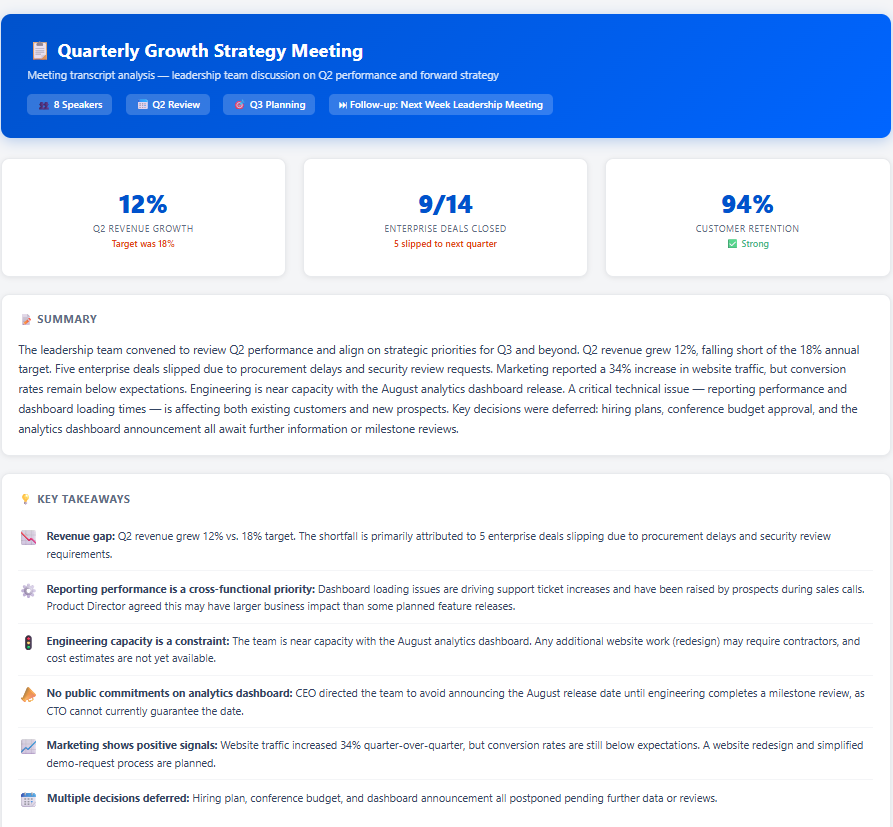
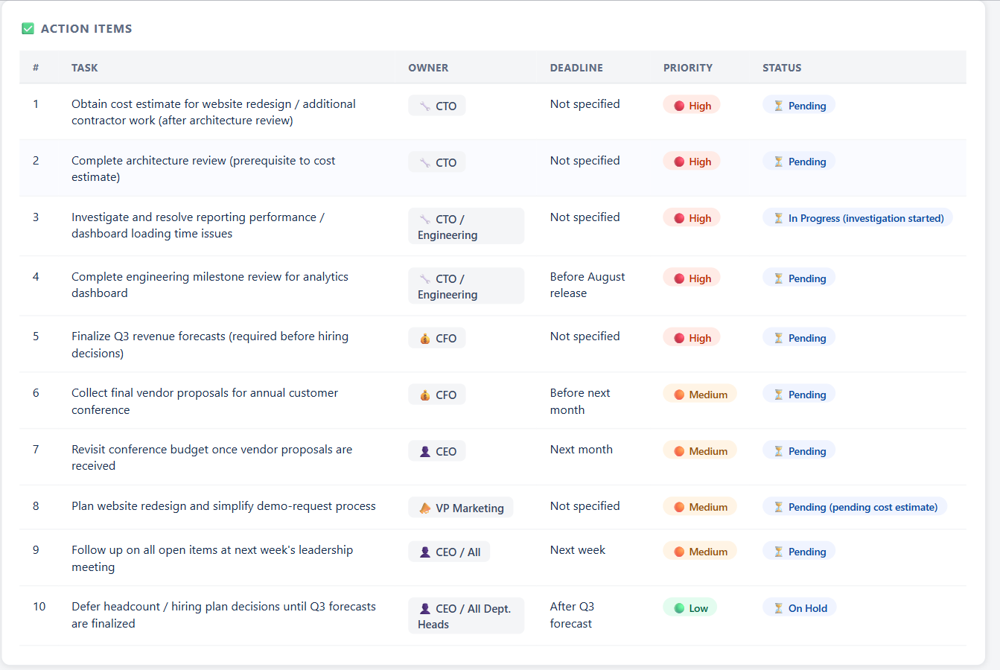
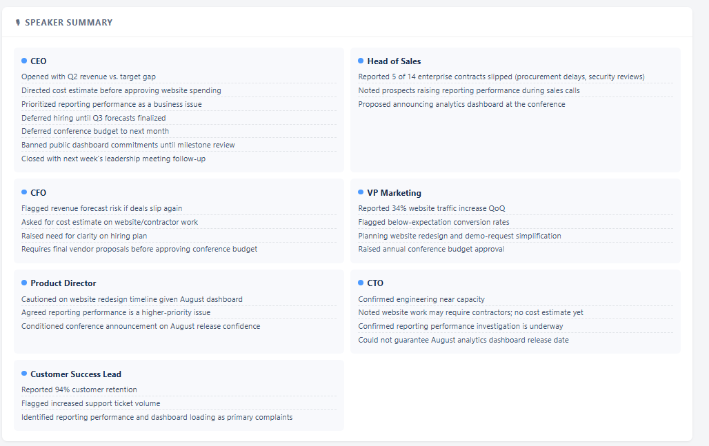
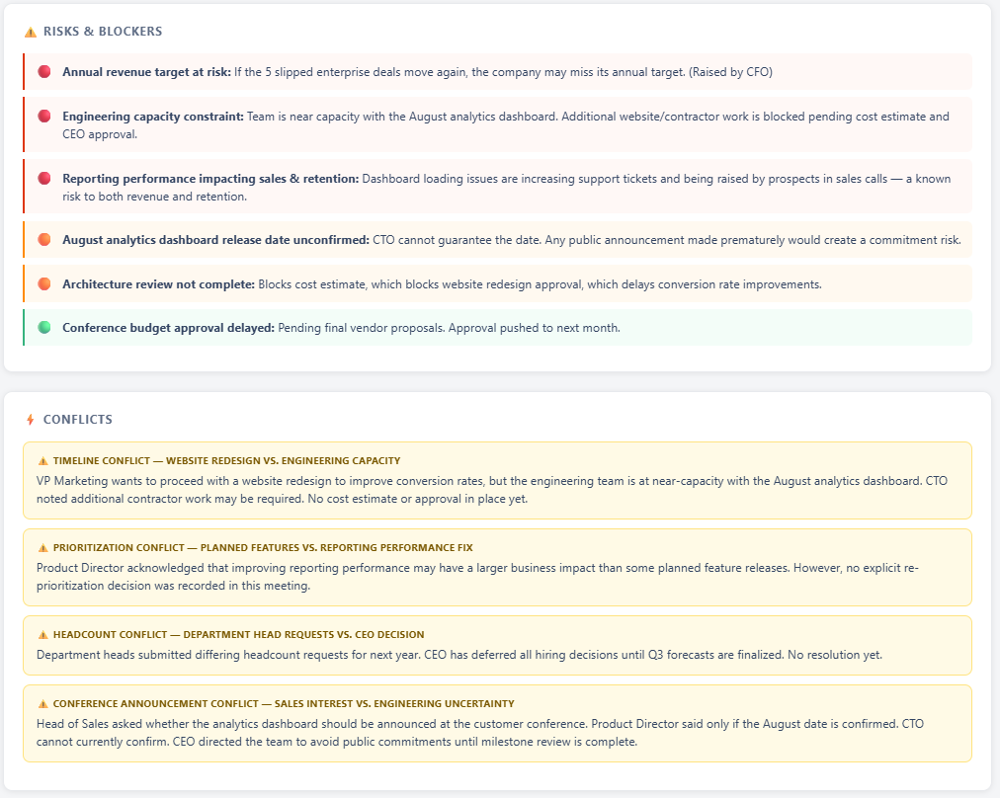
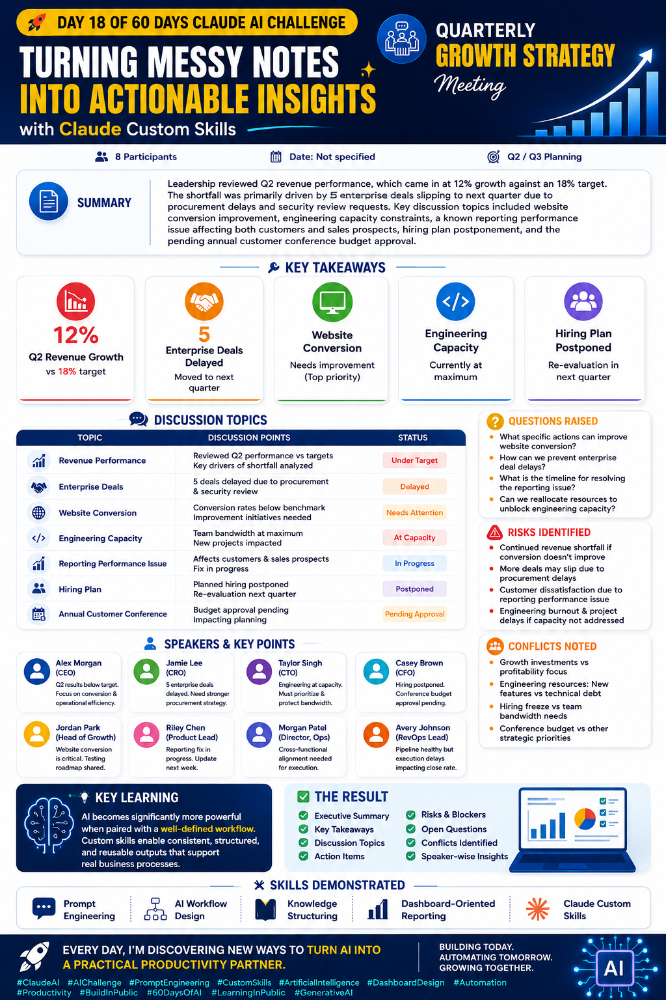

# Day 18 - Claude AI Challenge

## Brain Dump Action Planner using Claude Custom Skills

### Overview

As part of my **60 Days Claude AI Challenge**, I built a custom Claude Skill called **Brain Dump Action Planner**.

The objective of this skill is to transform unstructured information such as meeting transcripts, brainstorming sessions, voice notes, and raw notes into structured, actionable outputs.

The skill automatically organizes information into summaries, key takeaways, action items, risks, blockers, conflicts, open questions, and speaker-wise insights while preserving all original information without making assumptions.

---

## Project Objective

Convert messy and lengthy meeting discussions into a professional dashboard that helps teams:

* Quickly understand meeting outcomes
* Track action items
* Identify risks and blockers
* Monitor unresolved questions
* Improve decision-making and execution

---

## Custom Skill Details

### Skill Name

**Brain Dump Action Planner**

### Features

* Transcript Analysis
* Executive Summary Generation
* Action Item Extraction
* Risk & Blocker Identification
* Open Question Detection
* Conflict Identification
* Speaker-wise Attribution
* Interactive HTML Dashboard Generation
* Responsive Modern UI Design

---

## Workflow

### Step 1: Create Claude Custom Skill

Configured a custom skill with detailed instructions for processing:

* Meeting Notes
* Voice Memos
* Brain Dumps
* Team Discussions
* Project Reviews
* Strategy Meetings

### Step 2: Configure Output Structure

The skill was designed to generate:

1. Summary
2. Key Takeaways
3. Action Items
4. Open Questions
5. Risks & Blockers
6. Conflicts
7. Additional Notes
8. Speaker Analysis

### Step 3: Dashboard Generation

The output is automatically converted into a modern interactive HTML dashboard featuring:

* Cards
* Tables
* Status Badges
* Visual Indicators
* Responsive Layout
* Dashboard Components

---

## Sample Use Case

### Input

Quarterly Growth Strategy Meeting Transcript

### Output

A professional dashboard displaying:

* Revenue Performance Review
* Enterprise Deal Analysis
* Website Conversion Insights
* Engineering Capacity Review
* Hiring Plan Updates
* Risks & Concerns
* Leadership Discussion Summary

---

## Screenshots Included

---

## Skills Demonstrated

### AI Skills

* Prompt Engineering
* Claude Custom Skills
* Workflow Design
* Information Structuring
* AI Automation

### Technical Skills

* HTML Dashboard Design
* UI/UX Thinking
* Data Presentation
* Business Reporting
* Documentation

---

## Key Learnings

* Well-defined workflows significantly improve AI output quality.
* Custom Skills enable consistent and reusable results.
* AI can transform unstructured conversations into business-ready reports.
* Structured prompts help create scalable productivity systems.
* Dashboard-based reporting improves information accessibility and decision-making.

---

## Outcome

Successfully built and tested a Claude Custom Skill capable of transforming complex meeting discussions into actionable business dashboards.

This project demonstrates how AI can be leveraged to automate documentation, reporting, and decision-support workflows.

