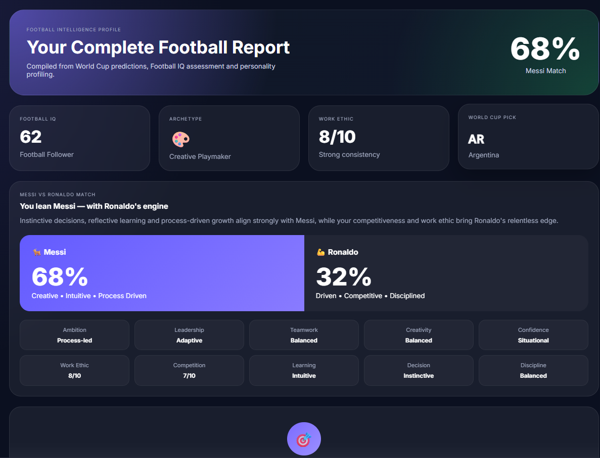
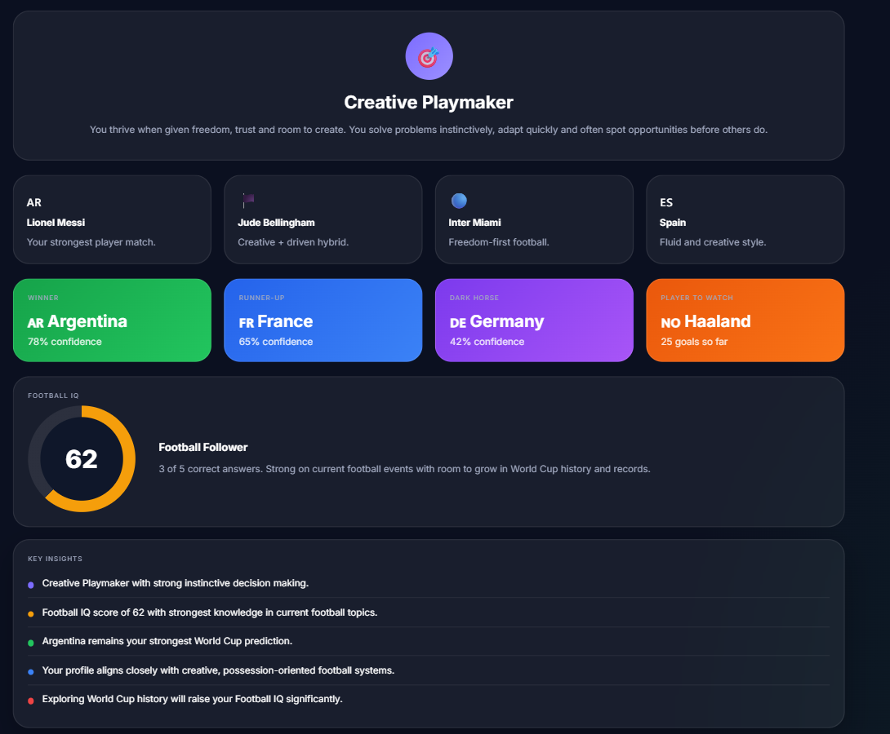
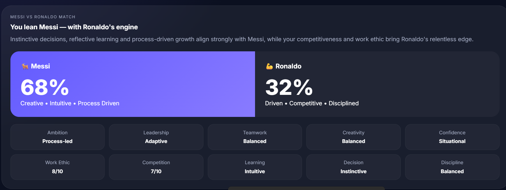
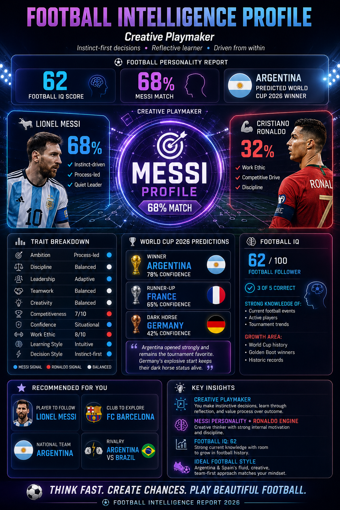

# Day 19 - Football Intelligence Profile Dashboard

Today’s task focused on transforming a Football Intelligence Assessment into a premium sports analytics dashboard using Claude. The objective was to visualize personality insights, football knowledge, player compatibility, and World Cup predictions in a professional infographic format.

---

# Project Deliverables

## 1. Football Intelligence Profile Dashboard

### Generated Asset

* Premium Football Intelligence Profile Poster
* Sports Analytics Dashboard Design
* Glassmorphism UI Elements
* Neon Purple & Electric Blue Theme
* LinkedIn-ready Infographic Format

### Dashboard Highlights

* Football IQ Score: 62/100
* Creative Playmaker Personality
* Messi Compatibility Analysis
* Ronaldo Compatibility Analysis
* World Cup 2026 Predictions
* Football Trait Breakdown
* Personalized Recommendations

---

# Screenshots

## Screenshot 1: Football Intelligence Profile Dashboard

---

## Screenshot 2: Football IQ Results

### Results

* Football IQ Score: 62/100
* Category: Football Follower
* Correct Answers: 3/5

### Strong Areas

* Current Football Events
* Active Players
* Tournament Trends

### Growth Areas

* World Cup History
* Golden Boot Winners
* Historic Football Records

---

## Screenshot 3: Messi vs Ronaldo Compatibility Analysis

### Compatibility Scores

| Player            | Match Percentage |
| ----------------- | ---------------- |
| Lionel Messi      | 68%              |
| Cristiano Ronaldo | 32%              |

### Messi Traits

* Instinct-driven
* Process-led
* Quiet Leader

### Ronaldo Traits

* Work Ethic
* Competitive Drive
* Discipline

---

## Screenshot 4: Football Personality Report

### Archetype

**Creative Playmaker**

Characteristics:

* Instinct-first decisions
* Reflective learner
* Driven from within
* Creative problem solver
* Team-oriented mindset

---

# Trait Analysis

| Trait           | Result         |
| --------------- | -------------- |
| Ambition        | Process-led    |
| Discipline      | Balanced       |
| Leadership      | Adaptive       |
| Teamwork        | Balanced       |
| Creativity      | Balanced       |
| Competitiveness | 7/10           |
| Confidence      | Situational    |
| Work Ethic      | 8/10           |
| Learning Style  | Intuitive      |
| Decision Style  | Instinct-first |

---

# World Cup 2026 Predictions

## Winner

🇦🇷 Argentina

* Confidence Score: 78%

## Runner-Up

🇫🇷 France

* Confidence Score: 65%

## Dark Horse

🇩🇪 Germany

* Confidence Score: 42%

### Insight

Argentina emerged as the strongest contender due to consistent performances and overall squad balance, while Germany retained dark horse status because of their explosive attacking potential.

---

# Personalized Football Recommendations

### Player To Follow

🐐 Lionel Messi

### Club To Explore

🏟 FC Barcelona

### National Team

🇦🇷 Argentina

### Rivalry

⚔ Argentina vs Brazil

---

# Key Learnings

## 1. AI-Powered Personality Analysis

AI can convert assessment data into meaningful personality insights and behavioral patterns.

## 2. Sports Analytics Visualization

Complex football data can be transformed into professional dashboards that are easy to understand and visually engaging.

## 3. Data Storytelling

Raw numbers become more impactful when presented through storytelling and visual design.

## 4. Personalization Through AI

AI can generate customized recommendations based on user preferences and behavioral traits.

## 5. Dashboard Design Principles

Learned how modern sports analytics dashboards use:

* Glassmorphism
* Data hierarchy
* Visual storytelling
* Comparative analysis
* Interactive-style layouts

---

# Tools Used

* Claude AI
* Football Intelligence Assessment
* Prompt Engineering
* Sports Analytics Concepts
* Dashboard Design Techniques

---

# Outcome

Successfully created a premium Football Intelligence Dashboard that combines personality assessment, football knowledge evaluation, player compatibility analysis, and predictive insights into a professional sports analytics experience.

