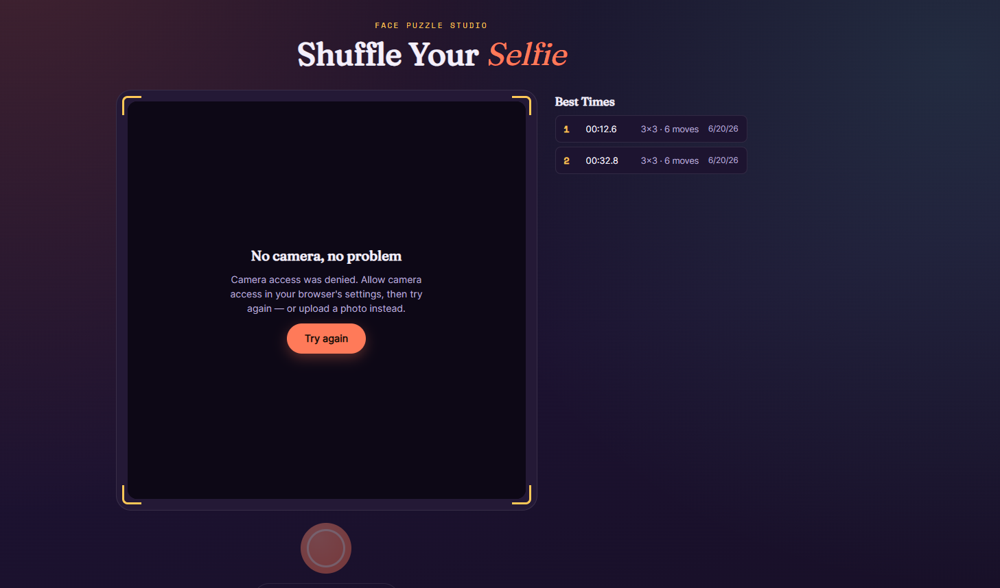
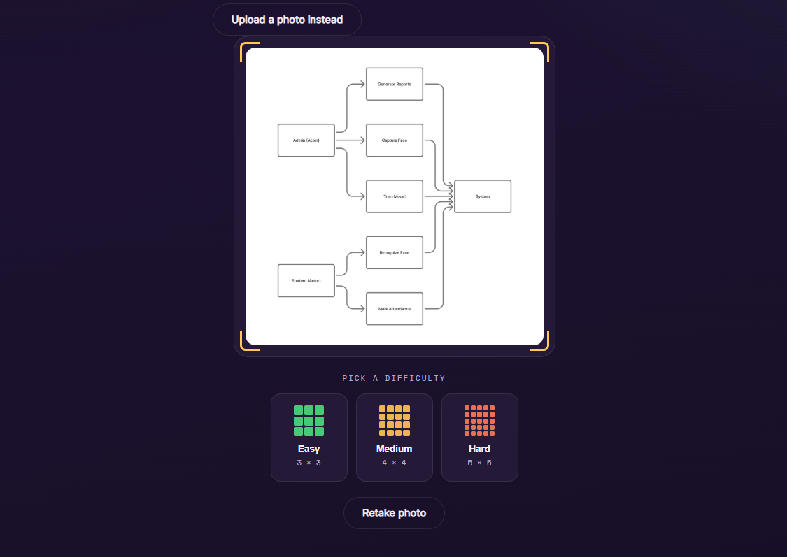
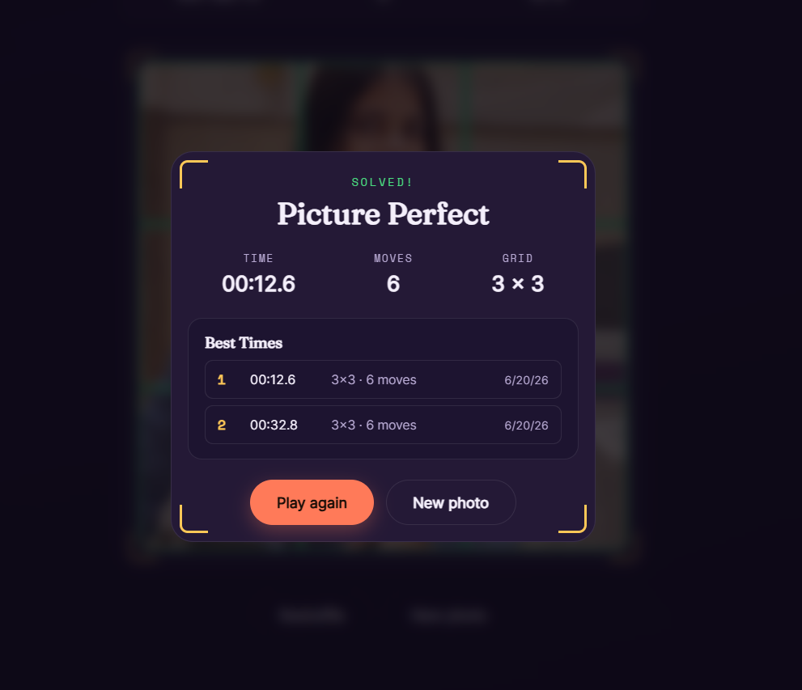
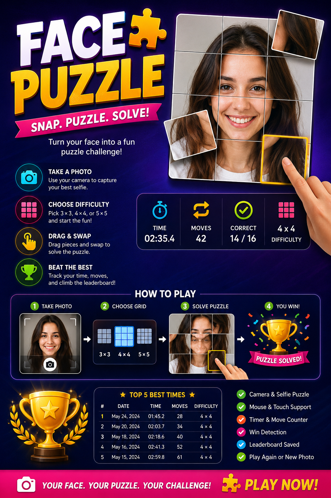

# Day 20 of 60 Days Claude Challenge

## Face Puzzle Game

## 📌 Project Overview

Today I built a **Face Puzzle Game** that transforms a user's selfie into an interactive sliding puzzle. The application uses the device camera to capture a photo, splits the image into puzzle pieces, shuffles them, and challenges users to reassemble the original picture.

The project was developed as a single self-contained HTML application using HTML, CSS, and JavaScript.

---

## 📸 Gameplay Screenshots

### Camera Capture Screen



### Difficulty Selection




### Puzzle Solved Screen



---

## 📄 Generated HTML File

### Project File

```text
face-puzzle.html
```

The application is built as a single standalone HTML file containing:

* HTML structure
* CSS styling
* JavaScript functionality
* Camera integration
* Puzzle generation logic
* Touch and drag controls
* LocalStorage leaderboard system

---

## 🎯 Completion Results

| Metric          | Result          |
| --------------- | --------------- |
| Difficulty      | 4 × 4           |
| Completion Time | XX:XX.X         |
| Total Moves     | XX              |
| Correct Pieces  | 16 / 16         |
| Status          | Puzzle Solved ✅ |

Replace the values above with your actual fastest completion record.

---

## 🚀 Features Implemented

### Camera System

* Webcam access using getUserMedia()
* Live camera preview
* Photo capture functionality
* Retake photo option
* Permission handling

### Puzzle Generation

* 3×3 Grid
* 4×4 Grid
* 5×5 Grid
* Automatic image slicing
* Solvable puzzle randomization

### Controls

* Mouse drag and drop
* Mobile touch support
* Tile swapping
* Snap-to-grid behavior
* Active tile highlighting

### Game Tracking

* Live timer
* Move counter
* Correct piece counter
* Win detection system

### Results & Leaderboard

* Completion summary
* Top 5 best times
* LocalStorage persistence
* Difficulty tracking
* Performance statistics

---

## 📚 Key Learnings

### 1. Working with Device Cameras

Learned how to access webcams using the MediaDevices API and capture image frames using HTML Canvas.

### 2. Canvas-Based Image Processing

Explored image slicing techniques to generate puzzle pieces dynamically from captured photos.

### 3. Drag-and-Drop Interactions

Implemented custom drag-and-drop behavior that works across desktop and mobile devices.

### 4. Puzzle State Management

Learned how to track tile positions, validate puzzle completion, and maintain game state efficiently.

### 5. LocalStorage Usage

Used browser storage to save leaderboard data and persist high scores across sessions.

### 6. Responsive Game Design

Built a UI that adapts smoothly across mobile phones, tablets, and desktop devices.

---

## 💡 Challenges Faced

* Managing touch and mouse events simultaneously
* Generating a solvable shuffled puzzle
* Handling different screen sizes responsively
* Optimizing drag performance on mobile devices
* Implementing accurate win detection



---

## 🏁 Conclusion

This project helped me gain practical experience in camera APIs, image manipulation, drag-and-drop mechanics, browser storage, and responsive game development. Building an interactive game from scratch was a great exercise in combining multiple front-end concepts into a single real-world application.

