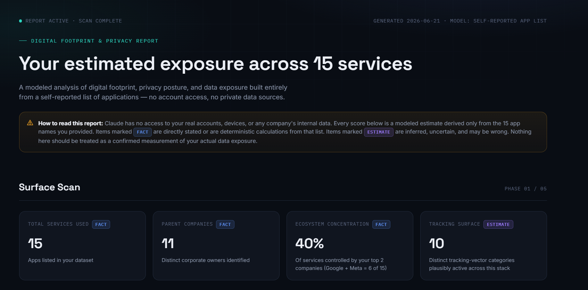
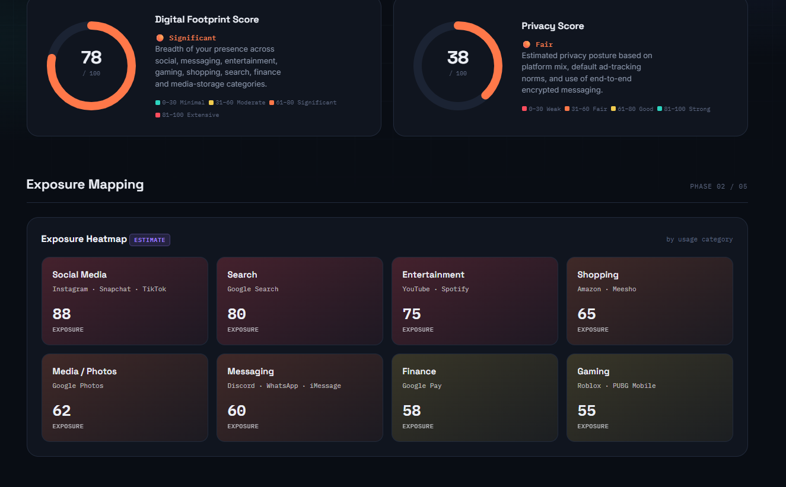
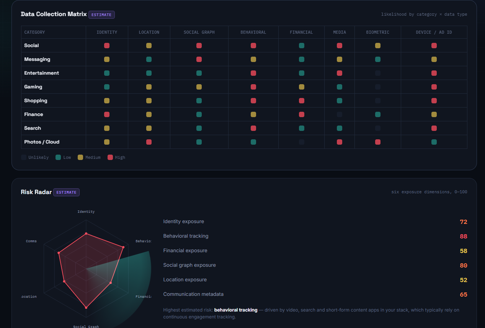
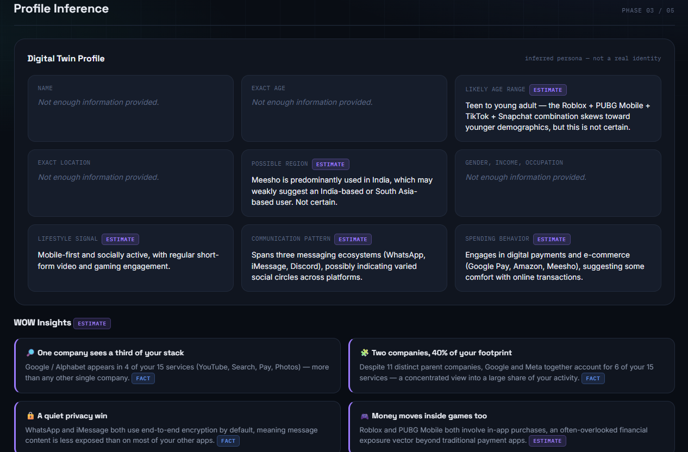
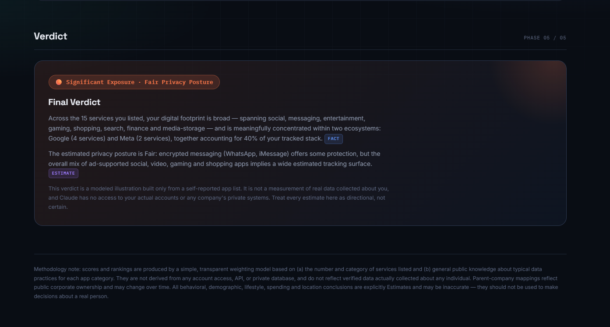

# Day 21 — Digital Footprint & Privacy Intelligence Dashboard

## 📌 Overview

For Day 21 of the **60 Days Claude Challenge**, I designed and developed a **Digital Footprint & Privacy Intelligence Dashboard** that visualizes a user's reported digital footprint in a modern cybersecurity-style interface.

The dashboard transforms a list of commonly used digital services into insightful privacy analytics while clearly distinguishing between **Facts** and **Estimates**. It is designed for educational and awareness purposes and does **not** claim access to any private databases or personal accounts.

---

## 🎯 Objective

* Visualize digital footprint exposure.
* Present privacy insights through an interactive dashboard.
* Demonstrate modern dashboard UI/UX principles.
* Follow responsible AI practices by separating facts from estimates.
* Provide actionable privacy improvement recommendations.

---

## 🛠 Technologies Used

* HTML5
* CSS3
* JavaScript
* Glassmorphism UI
* Responsive Dashboard Design
* SVG & CSS Visualizations

---

## 📊 Dashboard Features

* ✅ Digital Footprint Score
* ✅ Privacy Score
* ✅ Exposure Heatmap
* ✅ Company Exposure Ranking
* ✅ Data Collection Matrix
* ✅ Risk Radar
* ✅ Digital Twin Profile *(Estimates Only)*
* ✅ Most Valuable Data Assets
* ✅ WOW Insights
* ✅ Privacy Improvement Simulator
* ✅ Privacy Improvement Plan
* ✅ Final Privacy Verdict

---

## 📷 Project Screenshots

---

## 🔍 Key Learnings

* Designed a premium cybersecurity dashboard UI.
* Improved data visualization and information hierarchy.
* Learned to communicate privacy concepts clearly.
* Practiced separating factual information from inferred estimates.
* Enhanced frontend development skills using HTML, CSS, and JavaScript.
* Focused on creating an intuitive and responsive user experience.

---

## ⚠ Disclaimer

This project is created for educational purposes only.

* Uses only the user-provided dataset.
* Does not access private databases, accounts, or personal information.
* Behavioral insights are clearly marked as **Estimates**.
* Privacy recommendations are based on general cybersecurity best practices.

---

