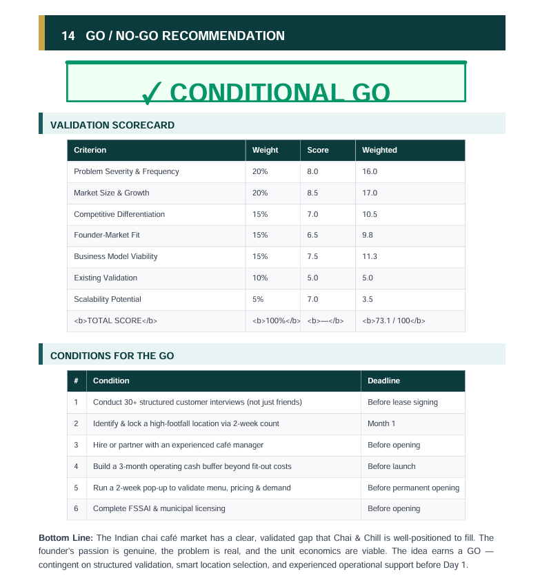
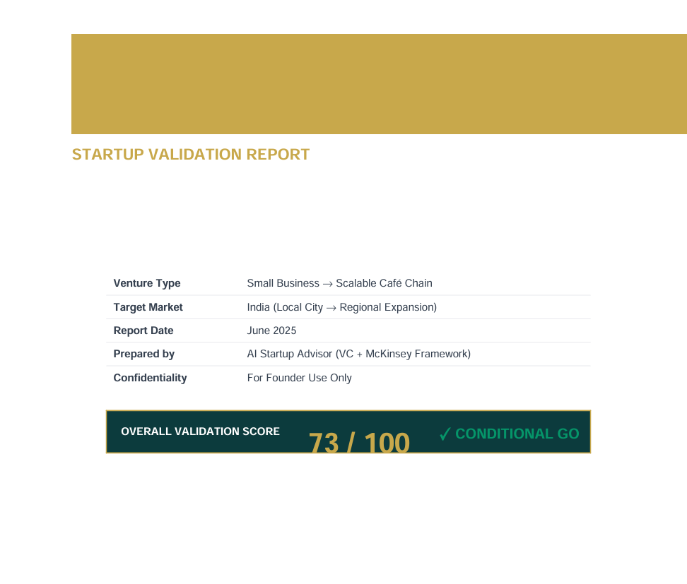
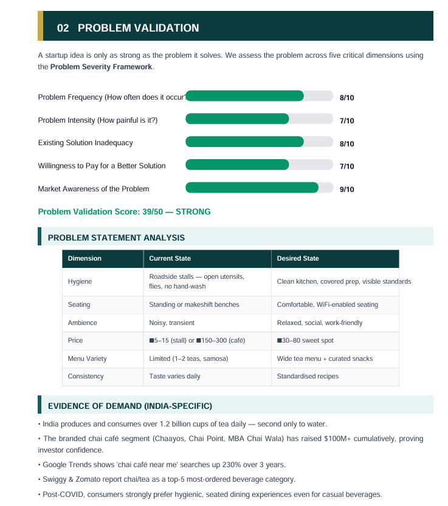
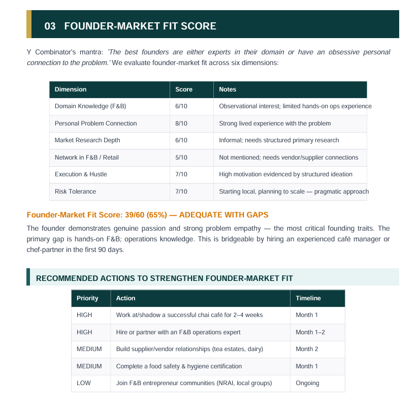
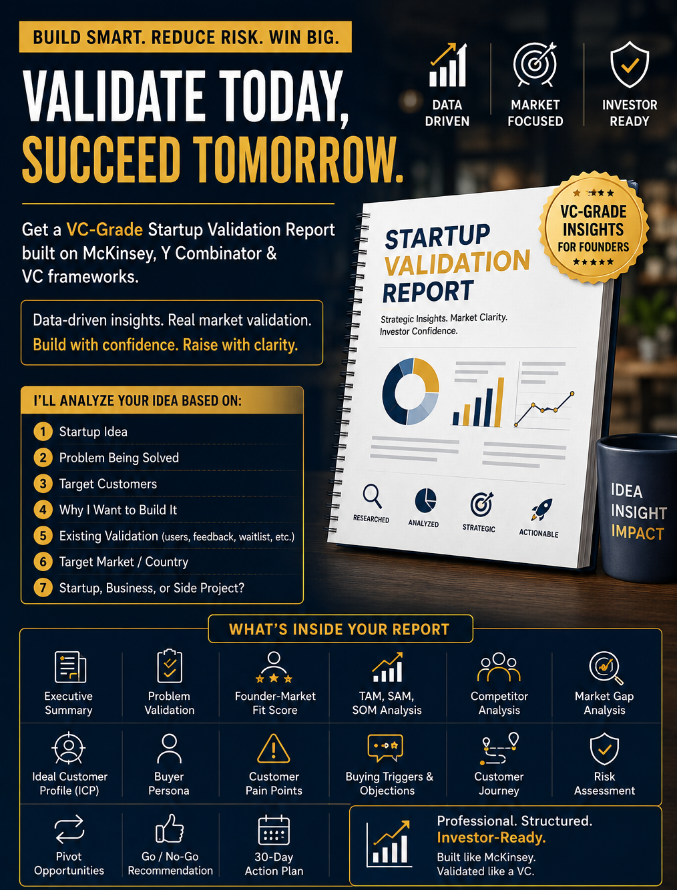

# 🚀 Day 22 – AI Startup Validation Report Generator

## 📌 Overview

For **Day 22 of the 60 Days Claude Challenge**, I built an **AI-powered Startup Validation Report Generator** that helps founders validate their startup ideas using structured business analysis.

The system collects essential startup information through **7 simple questions** and generates a **professional, PDF-ready Startup Validation Report** inspired by VC firms and consulting frameworks.

---

## ✨ Features

* 📝 Collects startup details through guided questions
* 📊 Executive Summary
* 🎯 Problem Validation
* 📈 TAM, SAM & SOM Market Analysis
* ⭐ Founder-Market Fit Score
* 🔍 Competitor Analysis
* 💡 Market Gap Analysis
* 👤 Ideal Customer Profile (ICP)
* 🧑‍💼 Buyer Persona
* ⚠️ Customer Pain Points
* 🛒 Buying Triggers & Objections
* 🗺️ Customer Journey Mapping
* 🚨 Risk Assessment
* 🔄 Pivot Opportunities
* ✅ Go / No-Go Recommendation
* 📅 30-Day Action Plan
* 📄 Professional PDF-ready report format

---

## 📂 Project Deliverables

* Startup Validation Report (PDF)
* AI Prompt
* Generated Report
* LinkedIn Poster
* Project Screenshots

---

## 🛠️ Built With

* Claude AI
* Prompt Engineering
* Startup Validation Frameworks
* Market Research Principles
* Business Strategy
* Markdown

---

## 📸 Screenshots

> Add screenshots of:

---

## 📚 Key Learnings

* Structuring AI prompts for business consulting workflows
* Startup validation methodologies
* Market sizing (TAM, SAM & SOM)
* Competitive and customer analysis
* Creating investor-ready documentation
* Professional report design using AI

---

## 🎯 Outcome

This project demonstrates how AI can help entrepreneurs quickly evaluate startup ideas before investing significant time and capital, enabling smarter, data-driven decision-making.

---
