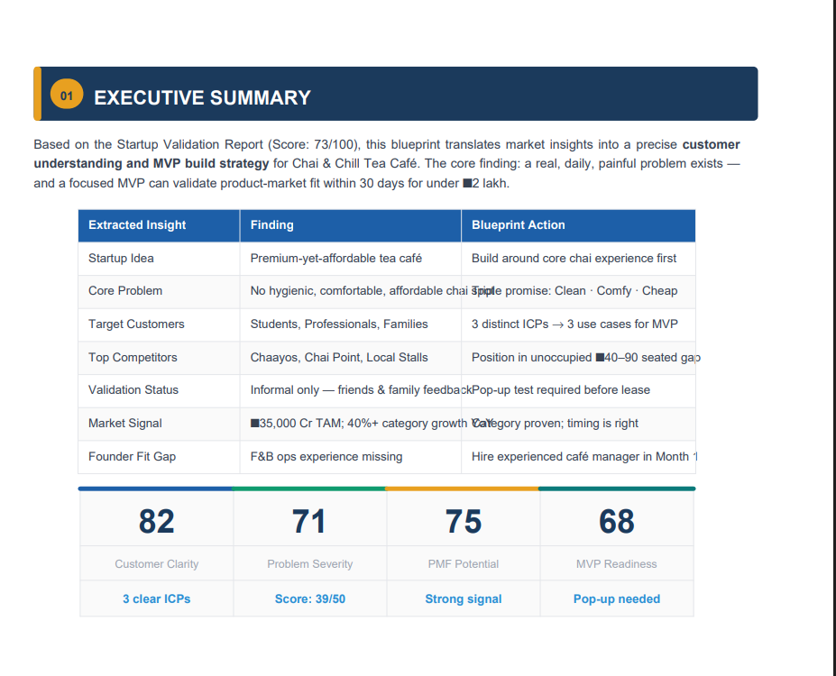
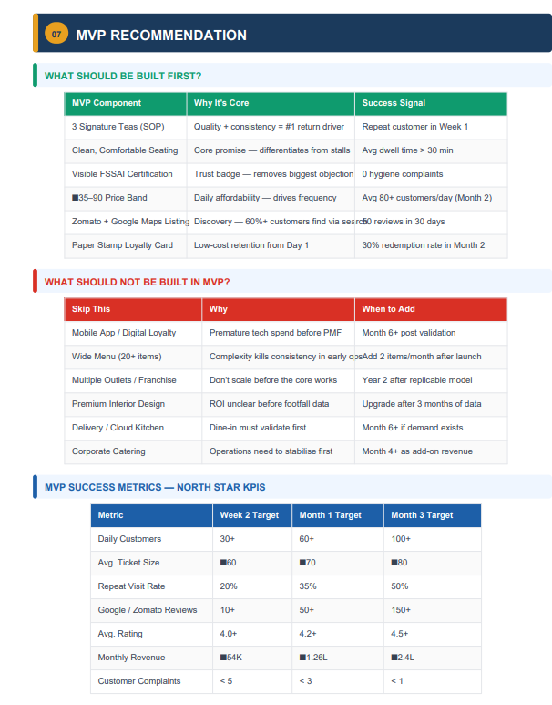
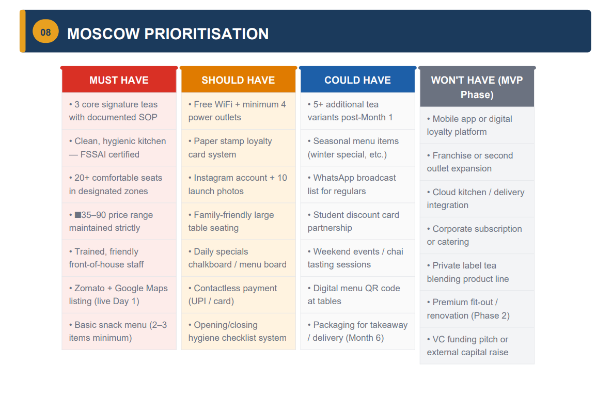
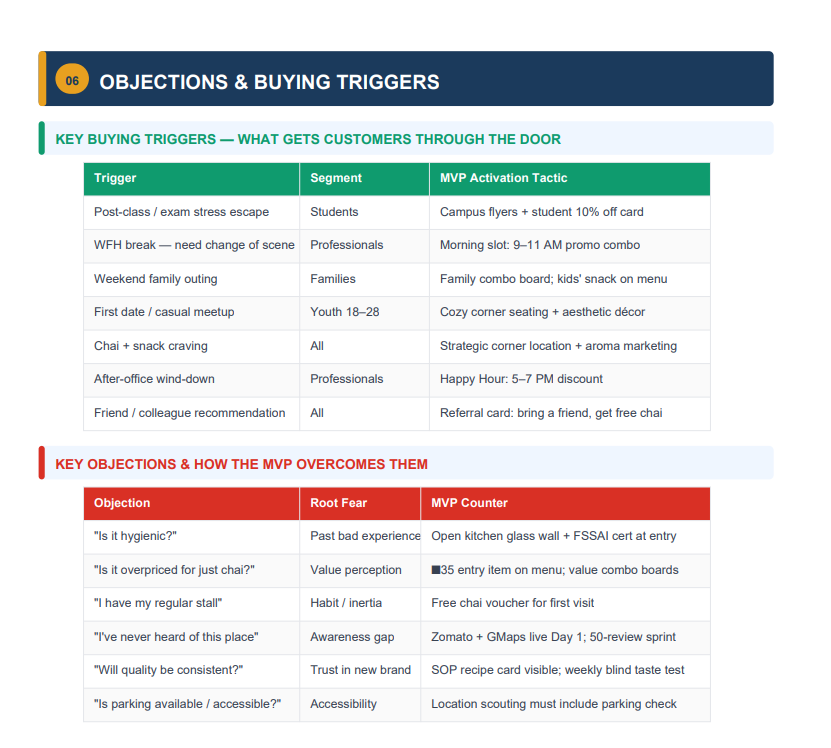
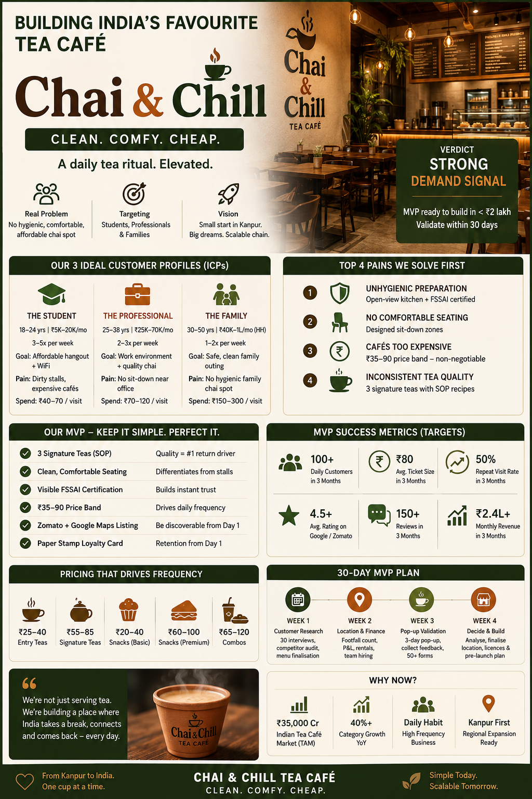

# 🚀 Day 23 of #60DaysClaudeChallenge
# Customer & MVP Blueprint – AI Chatbot for Local Businesses

## 📌 Project Overview

Today I worked on creating a **Customer & MVP Blueprint** for an AI-powered chatbot designed specifically for local businesses.

The goal was to move beyond just having an idea and build a structured product strategy by identifying the right customers, validating problems, prioritizing MVP features, and defining a roadmap before development.

---

# 🎯 Problem Statement

Small and medium-sized local businesses often:

- Miss customer inquiries after business hours
- Spend hours answering repetitive questions
- Lose leads due to delayed responses
- Cannot afford dedicated customer support teams
- Need an affordable AI solution

---

# 💡 Proposed Solution

An AI-powered chatbot that helps local businesses by:

- 🤖 Answering FAQs automatically
- 📅 Booking appointments
- 💬 Managing WhatsApp conversations
- 📈 Capturing leads
- 🌐 Supporting regional languages
- 📊 Providing customer analytics

---

# 👥 Target Customers

Primary audience:

- Salons
- Clinics
- Gyms
- Coaching Institutes
- Restaurants
- Service-based Local Businesses

Ideal Customer Profile:

- Small business owners
- Active on WhatsApp
- Limited support staff
- Looking for affordable automation
- Need 24/7 customer engagement

---

# 🔍 Customer Insights

Key customer pain points identified:

- Missing leads after working hours
- Slow customer response time
- Repetitive customer queries
- High operational workload
- No automated appointment system
- Limited technical expertise
- Budget constraints

These insights helped prioritize the MVP scope.

---

# 🧩 MVP Recommendations

The first version of the product should include only the highest-impact features:

- AI FAQ Assistant
- Appointment Booking
- Lead Capture
- WhatsApp Integration
- Business Information Responses
- Human Handoff
- Basic Analytics Dashboard

Future versions can include:

- CRM Integration
- Payment Collection
- Marketing Automation
- Advanced Analytics
- Multi-language AI
- Customer Segmentation

---

# 📈 Validation Summary

## Strengths

- Large addressable market
- Real business problem
- Affordable pricing opportunity
- Strong demand for automation

## Challenges

- Product validation required
- Need real customer interviews
- Build trust with local businesses
- Competition from existing chatbot platforms

---

# 🖼️ Project Screenshots

---

---

---

---

## LinkedIn Poster

---

# 🛠️ Tech & Product Skills Practiced

- Product Thinking
- Customer Discovery
- MVP Planning
- Startup Validation
- Market Research
- Customer Personas
- Journey Mapping
- Problem Prioritization
- Product Strategy
- Business Analysis

---

# 📚 Key Learnings

- Build for customer problems, not assumptions.
- Validate ideas before writing code.
- A focused MVP is more valuable than a feature-heavy product.
- Customer interviews provide better insights than guessing.
- Prioritizing features helps reduce development time.
- Product success depends on solving real customer pain points.
- Iterative validation minimizes business risk.
- Great products start with understanding users deeply.

---

# 🚀 Outcome

This exercise helped transform a startup idea into a structured product blueprint by defining:

- Customer Personas
- Customer Journey
- Pain Points
- Market Opportunity
- MVP Scope
- Product Roadmap
- Validation Strategy
- Business Recommendations

A valuable step toward building a customer-centric AI product.

---