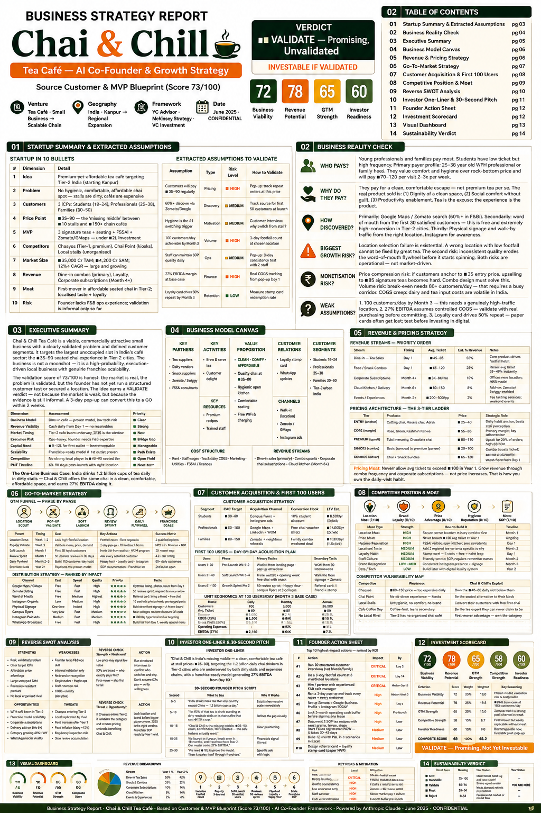
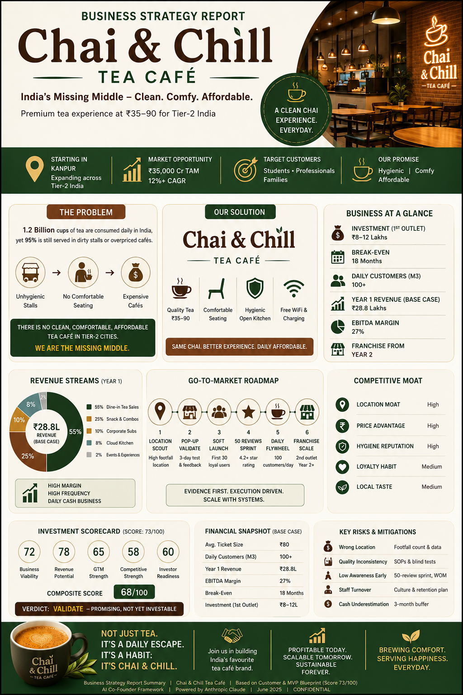

# Day 24 – Business Strategy Report | Chai & Chill Tea Café ☕

## 📌 Overview

On **Day 24** of my **#60DaysOfClaude** challenge, I created a comprehensive **Business Strategy Report** for **Chai & Chill Tea Café**.

The objective was to transform a validated startup idea into a structured business strategy by analyzing the market, defining a scalable business model, evaluating financial feasibility, identifying risks, and preparing a growth roadmap.

---

## 🎯 Project Objective

Develop a concise business strategy that answers:

* Is the business commercially viable?
* Who are the target customers?
* How will the business generate revenue?
* What is the go-to-market strategy?
* What are the biggest risks and competitive advantages?
* Is the startup ready for investment?

---

## 📊 Report Highlights

* Business Strategy Summary
* Business Model Canvas
* Revenue & Pricing Strategy
* Go-To-Market (GTM) Strategy
* Customer Acquisition Plan
* Competitive Analysis & Moat
* Reverse SWOT Analysis
* Investment Scorecard
* Financial Snapshot
* Growth Roadmap
* Sustainability Verdict

---

## 💡 Key Insights

* Identified a market gap for affordable, hygienic tea cafés in Tier-2 cities.
* Designed multiple revenue streams beyond tea sales.
* Built a customer acquisition strategy focused on organic growth and local marketing.
* Evaluated competitive positioning against existing café brands.
* Assessed investment readiness using structured business metrics.
* Highlighted execution risks and practical mitigation strategies.

---

## 📷 Project Assets

### Business Strategy Report (PDF)

```
Business_Strategy_Report_TeaCafe.pdf
```
---





---

## 📚 Key Learnings

* A successful startup requires more than a good idea—it needs validation and execution.
* Business models should be supported by realistic financial assumptions.
* GTM planning is essential for sustainable growth.
* Understanding customer behavior is critical for product-market fit.
* Competitive advantages must be intentional and difficult to replicate.
* Data-driven decision-making improves investor confidence.

---

## 🚀 Outcome

This exercise strengthened my understanding of startup strategy, business planning, financial analysis, and market positioning while converting a business concept into an investor-friendly strategy document.

---