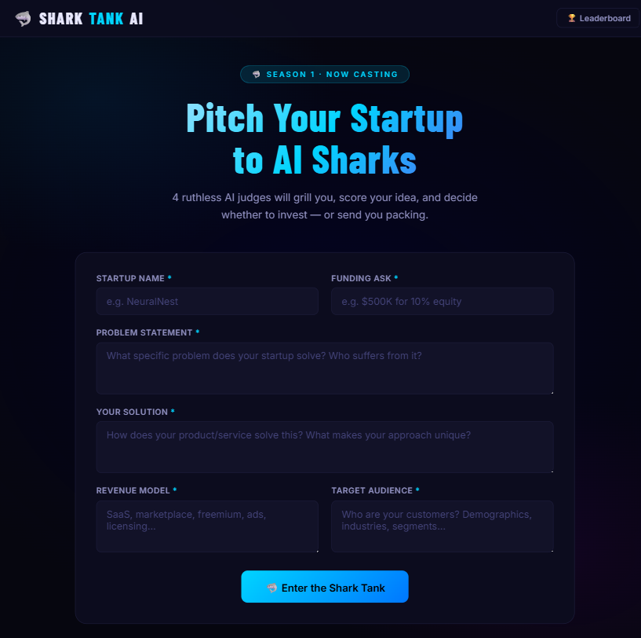
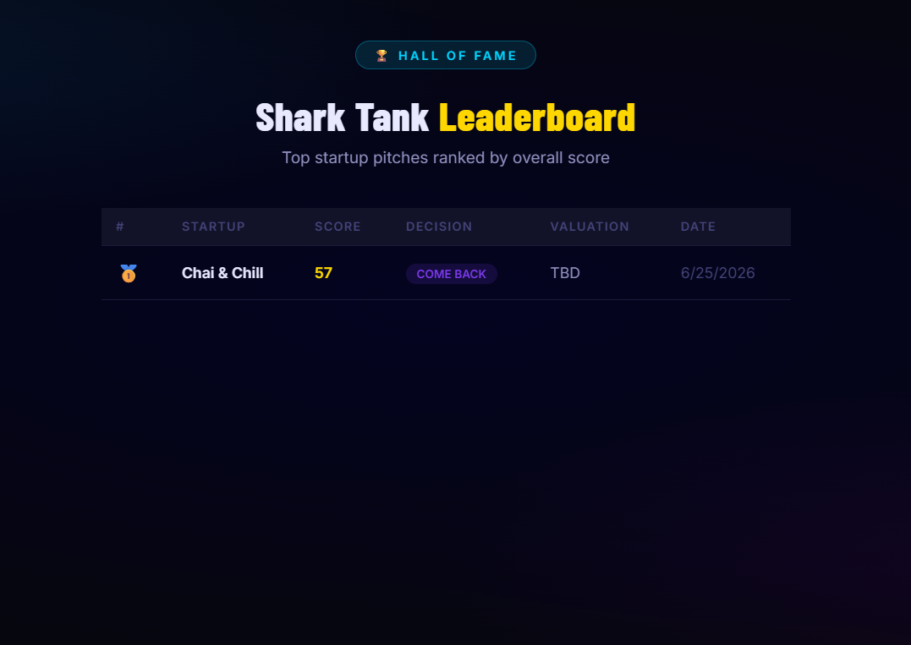
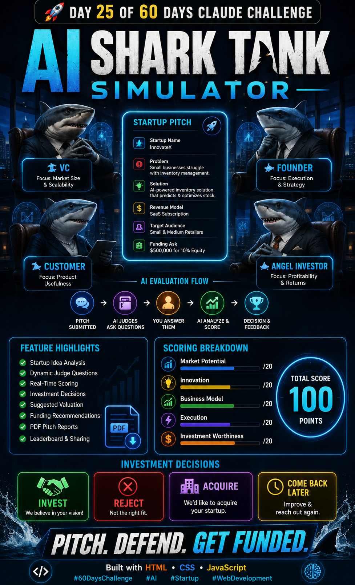

# Day 25 – AI Shark Tank Simulator

## 🚀 60 Days Claude Challenge – Day 25

### Project Overview

AI Shark Tank Simulator is an interactive web application that allows founders to pitch startup ideas to four AI-powered investors and receive detailed feedback, scoring, and investment recommendations.

---

# 📸 Project Screenshots

## Main Dashboard



## Leaderboard



## Summary



---

# 💻 Generated HTML Application

**File Name**

```text
shark-tank-simulator.html
```

### Core Features

* Startup Idea Submission
* AI Venture Capitalist Judge
* AI Founder Judge
* AI Customer Judge
* AI Angel Investor Judge
* Dynamic Questioning System
* Real-Time Startup Evaluation
* Investment Scoring Engine
* Funding Recommendations
* PDF Report Generation
* Leaderboard System
* Share Result Functionality
* Responsive Design

---

# 🦈 Startup Evaluation Example

## Startup Name

InnovateX

## Problem Statement

Small businesses struggle with inventory management and stock forecasting.

## Solution

AI-powered inventory optimization platform that predicts demand and automates restocking.

## Revenue Model

Monthly SaaS Subscription

## Target Audience

Small and Medium Businesses

## Funding Ask

$500,000 for 10% Equity

---

# 📊 Evaluation Results

| Category              | Score |
| --------------------- | ----- |
| Market Potential      | 18/20 |
| Innovation            | 17/20 |
| Business Model        | 19/20 |
| Execution             | 16/20 |
| Investment Worthiness | 18/20 |

## Total Score

**88 / 100**

---

# 💰 Investment Decisions

### 🦈 Venture Capitalist

Decision: INVEST

Reason:
Large addressable market with strong scalability potential.

---

### 🦈 Founder

Decision: INVEST

Reason:
Execution plan is realistic and achievable.

---

### 🦈 Customer

Decision: INVEST

Reason:
Solves a genuine business pain point.

---

### 🦈 Angel Investor

Decision: COME BACK LATER

Reason:
Would like additional proof of customer traction.

---

# 📈 Suggested Valuation

**$5 Million Pre-Money Valuation**

---

# 💵 Recommended Funding

**$500,000 Seed Investment**

---

# 🎯 Final Verdict

## INVEST

The startup demonstrates strong market demand, recurring revenue potential, and scalable SaaS economics.

---

# 📚 Key Learnings

* Different investors evaluate startups through unique lenses.
* Market size and scalability are critical for venture funding.
* Product usefulness drives long-term adoption.
* Strong unit economics improve investment attractiveness.
* AI can simulate realistic startup evaluation workflows.
* Interactive feedback systems create engaging user experiences.
* Gamification increases user participation and retention.
* PDF reporting and sharing features improve product value.

---

# 🛠 Tech Stack

* HTML5
* CSS3
* JavaScript (Vanilla)
* Local Storage
* Canvas API
* Responsive Design

---

# Challenge Reflection

Building the AI Shark Tank Simulator helped me understand startup evaluation frameworks, investor psychology, SaaS business models, and advanced frontend product design while creating a fully interactive no-backend web application.

#Day25 #60DaysChallenge #ClaudeChallenge #AI #Startup #WebDevelopment
