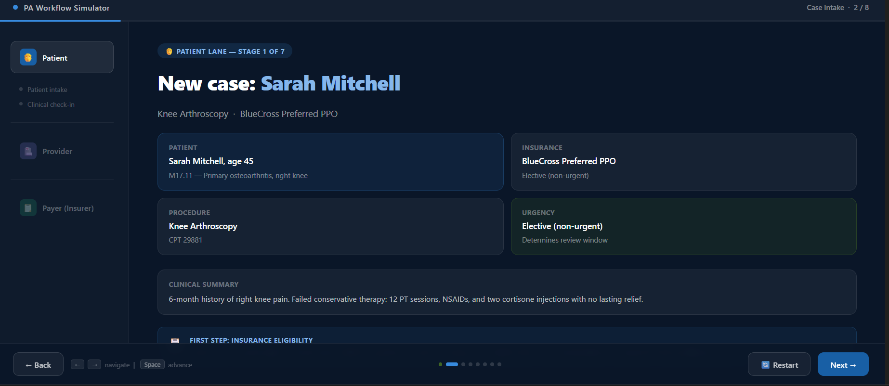
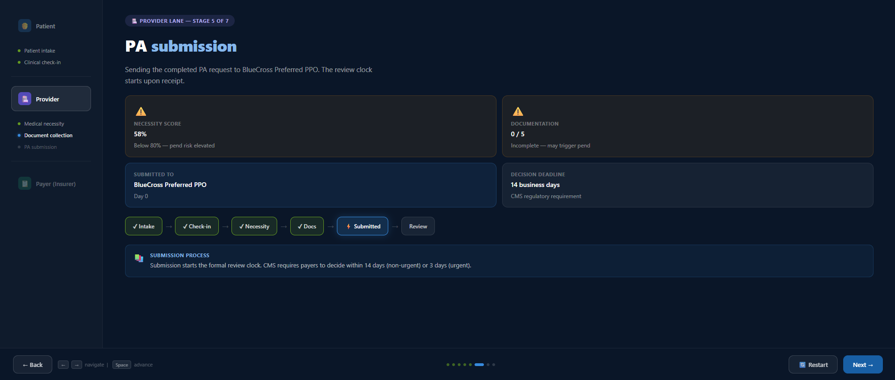
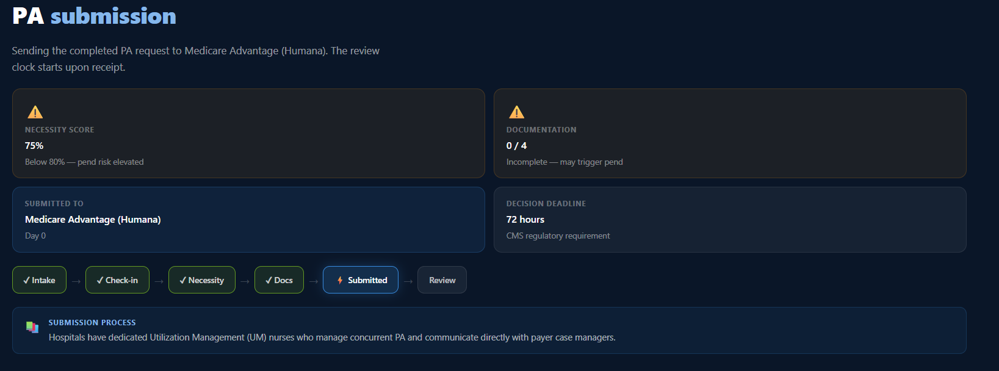
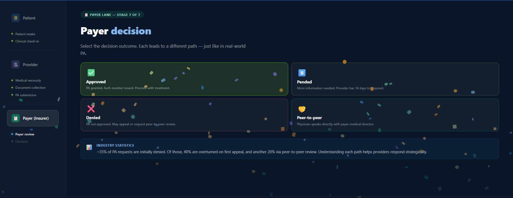

# Day 26 – Prior Authorization Workflow Simulator

## 📌 Project Overview

Today, I built a **Prior Authorization Workflow Simulator** as part of my **#60DaysChallenge**. The application simulates the U.S. healthcare Prior Authorization (PA) process through an interactive, gamified, drag-and-drop workflow.

The simulator helps users understand how authorization requests move between the **Patient**, **Provider**, and **Payer** while demonstrating different review outcomes.

---

# 📸 Project Screenshots

## Home Screen

---

## Prior Authorization Submission

---

## Review Outcome

---

## Payer Workflow Summary

---

# 📄 Generated HTML File

**File Name**

`prior-auth-simulator.html`

### Technology Used

* HTML5
* CSS3
* Vanilla JavaScript

### Features

* Interactive drag-and-drop workflow
* Patient, Provider, and Payer lanes
* Multiple healthcare scenarios
* Medical necessity evaluation
* Prior Authorization document collection
* Submission to payer
* Approval, Pend, Denial, Appeal, and Peer-to-Peer Review outcomes
* Progress tracker
* Days elapsed counter
* Efficiency score
* Celebration animation
* Workflow summary
* Responsive design
* Restart / New Patient functionality

---

# ✅ Completed Workflow Summary

### Example Scenario

**Patient:** MRI Authorization

Workflow Completed:

* Patient selected
* Medical necessity evaluated
* Required documents collected
* Authorization submitted
* Payer review completed
* Authorization Approved
* Workflow completed successfully

### Performance

* Total Workflow Steps: 6
* Days Elapsed: 5
* Efficiency Score: 820
* Final Status: **Approved**

---

# 🎯 Key Learnings

* Learned the complete Prior Authorization workflow used in U.S. healthcare.
* Improved JavaScript state management without external libraries.
* Built an interactive drag-and-drop interface using the HTML Drag and Drop API.
* Designed a multi-lane workflow visualization for better user understanding.
* Implemented conditional workflow outcomes such as Approval, Pend, Denial, Appeal, and Peer-to-Peer Review.
* Enhanced user engagement with progress tracking, scoring, and completion animations.
* Practiced creating responsive layouts using only HTML, CSS, and Vanilla JavaScript.
* Strengthened skills in building educational simulations through real-world business workflows.

---

## 🚀 Challenge Progress

**Day 26 of 60 Days Challenge**

Building one real-world project every day to improve my problem-solving, frontend development, and application design skills.

---

**#60DaysChallenge #Day26 #HealthcareTech #PriorAuthorization #HTML #CSS #JavaScript #FrontendDevelopment #BuildInPublic #LearningInPublic**
