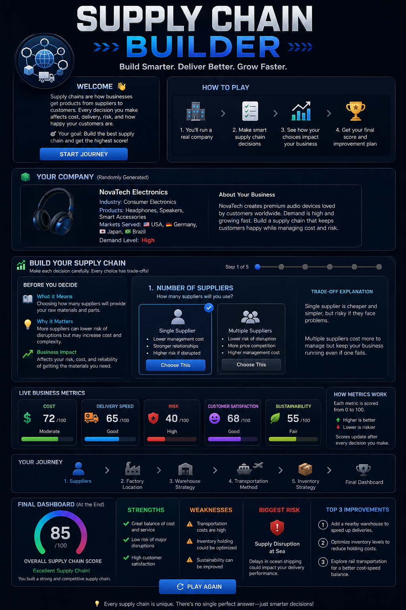

# Day 30 – Supply Chain Builder

## Overview

Today I built **Supply Chain Builder**, an interactive business simulation designed to teach supply chain fundamentals through hands-on decision making.

The application guides users through the process of designing a complete supply chain while explaining the business impact of every choice in simple language.

---

## Project Objective

Supply chains are often viewed as complex systems involving suppliers, factories, warehouses, transportation, and inventory management.

The goal of this project was to create an educational simulator that helps beginners understand:

* What a supply chain is
* Why supply chains matter
* How business decisions affect performance
* The trade-offs between cost, speed, risk, and customer satisfaction

---

## Features

### Random Company Generation

Every playthrough generates a unique company with:

* Industry
* Products
* Countries served
* Demand level

This creates different business scenarios and encourages strategic thinking.

### Supply Chain Decisions

Players build their supply chain by choosing:

1. Number of Suppliers
2. Factory Location
3. Warehouse Strategy
4. Transportation Method
5. Inventory Strategy

### Educational Guidance

Before every decision, the simulator explains:

* What the concept means
* Why it matters
* How it impacts the business

### Live Business Metrics

Metrics update instantly after every decision:

* Cost
* Delivery Speed
* Risk
* Customer Satisfaction
* Sustainability

### Final Performance Dashboard

At the end of the simulation, users receive:

* Overall Supply Chain Score (0–100)
* Key Strengths
* Major Weaknesses
* Biggest Risk
* Three Practical Improvement Recommendations

---

## Screenshots

---

## Technology Used

* HTML
* CSS
* JavaScript
* React (CDN)
* Babel

No backend, APIs, databases, or external assets were used.

---

## Key Learnings

### Every Decision Has Trade-Offs

A cheaper option may increase risk.

A faster transportation method may significantly increase costs.

A larger inventory may improve reliability but reduce efficiency.

### Supply Chains Are Connected Systems

A single decision can affect multiple business outcomes simultaneously.

Changes in one area often create consequences elsewhere.

### Business Optimization Is About Balance

The best supply chain is not always the cheapest or fastest.

Successful businesses balance:

* Cost
* Speed
* Risk
* Sustainability
* Customer Experience

---

## Challenges Faced

* Designing a beginner-friendly learning experience
* Creating meaningful trade-offs for every decision
* Balancing metrics so choices feel realistic
* Presenting business concepts in simple language

---

## Outcome

The final application transforms supply chain management into an interactive learning experience.

Users can experiment with different strategies, observe business outcomes, and develop a deeper understanding of how supply chains operate in the real world.

---

## Day 30 Reflection

This project reinforced the importance of systems thinking.

Supply chains are not just about moving products from one place to another—they are strategic networks that directly influence profitability, customer satisfaction, and business resilience.

Thirty days into the challenge, the focus remains the same:

**Build. Learn. Improve. Repeat.**
