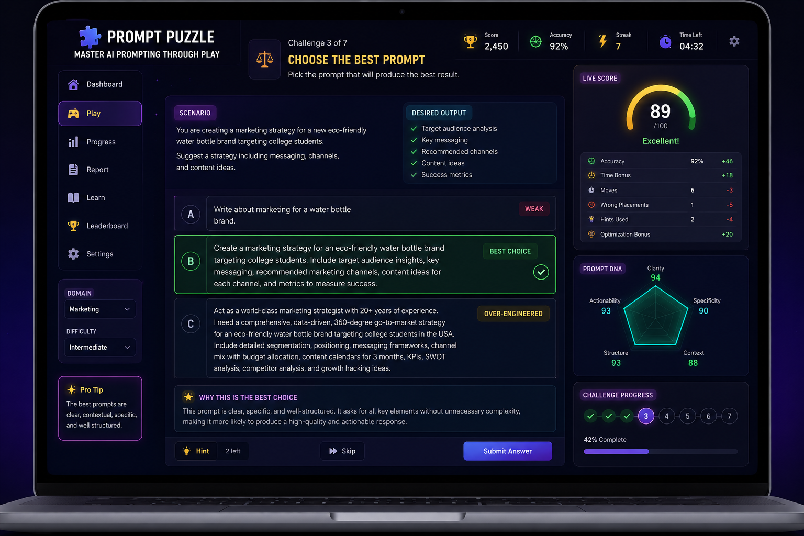

# 🧩 Prompt Puzzle — Master AI Prompting Through Play

## Day 35 — #60DayClaudeChallenge

### Overview

Prompt Puzzle is an interactive web application designed to help users improve their prompt engineering skills through gamified learning. Instead of reading theory, users actively solve prompt-related challenges, compare outcomes, and learn optimization techniques through hands-on practice.

The application generates randomized scenarios based on selected domains and difficulty levels, helping users understand how prompt quality directly impacts AI outputs.

---

## Screenshots

### 1. Application Home Screen

---

### 2. Build the Prompt Challenge

---

### 3. Clean the Prompt Challenge

---

### 4. Choose the Best Prompt Challenge

---

### 5. Prompt Performance Report

---

### 6. Poster Prompt

---

## Generated HTML File

**File Name:** `prompt_puzzle.html`

Features included:

* Offline-first single-file application
* Randomized prompt engineering scenarios
* Three challenge types
* Drag-and-drop interactions
* Live scoring system
* Prompt optimization comparisons
* Prompt DNA visualization
* Personalized feedback engine
* Progress tracking and replay support
* Responsive modern UI

---

## Prompt Performance Report

### Example Results

| Metric             | Score  |
| ------------------ | ------ |
| Accuracy           | 92%    |
| Time Bonus         | +18    |
| Optimization Bonus | +20    |
| Wrong Placements   | 1      |
| Hints Used         | 2      |
| Total Prompt Score | 89/100 |

### Rating

⭐⭐⭐⭐⭐ A+

### Rank

Top 12% of Prompt Engineers

### Prompt DNA

| Skill Area    | Score |
| ------------- | ----- |
| Clarity       | 94    |
| Specificity   | 90    |
| Structure     | 93    |
| Context       | 88    |
| Actionability | 93    |

---

## Key Learnings

### 1. Specificity Improves Results

Detailed instructions consistently produced more accurate and useful AI outputs than vague prompts.

### 2. Context Matters

Providing background information allows AI systems to generate more relevant and targeted responses.

### 3. Structure Creates Consistency

Well-organized prompts with clear sections improve output quality and reliability.

### 4. Simplicity Beats Complexity

Over-engineered prompts often add unnecessary complexity without improving results.

### 5. Constraints Are Powerful

Defining format, audience, tone, and goals helps guide AI toward the desired outcome.

### 6. Iteration Is Essential

Prompt engineering is an iterative process where continuous refinement leads to better performance.

---

## Technologies Used

* HTML5
* CSS3
* JavaScript
* React (CDN)
* Babel
* Local Browser Storage

---

## Challenge Reflection

Building Prompt Puzzle highlighted how effective prompt engineering combines clarity, structure, context, and intent. By turning prompt writing into an interactive game, complex concepts become easier to understand and more engaging to practice.

The project demonstrates that prompt engineering is not just a technical skill—it is a communication skill that significantly impacts AI performance.

---

### #60DayClaudeChallenge

