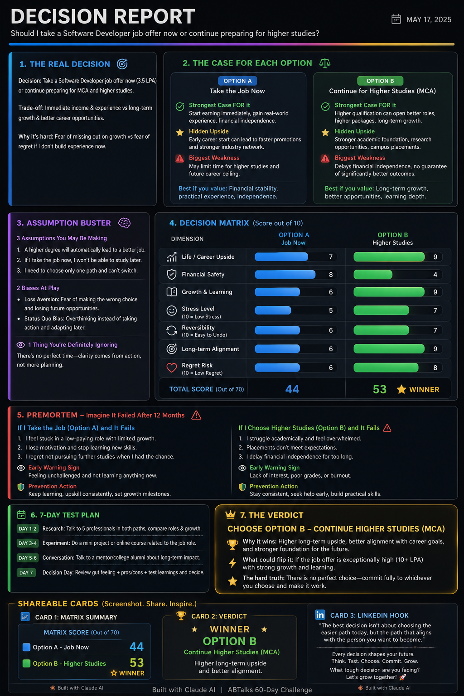

# Day 45 – AI Decision Strategist

## 📸 Project Screenshot

---

# 🧠 AI Decision Strategist

## Overview

Today I built an **AI Decision Strategist**, an application that helps users make difficult decisions through structured thinking rather than emotional reactions.

Instead of immediately suggesting an answer, the AI asks a series of focused questions, identifies assumptions and cognitive biases, compares multiple options using a decision matrix, performs a premortem analysis, and finally generates a comprehensive Decision Report.

The goal is to help users make confident, logical, and well-informed decisions.

---

# ✨ Features

- Guided 4-step decision interview
- Option-by-option comparison
- Decision Matrix with weighted scoring
- Assumption & Bias Analysis
- Premortem (Failure Prediction)
- 7-Day Decision Test Plan
- Final AI Verdict
- Shareable summary cards
- Modern interactive HTML dashboard

---

# 💡 What I Learned

- Good decisions require structured thinking.
- Breaking large decisions into measurable factors improves clarity.
- Cognitive biases often influence choices without us realizing it.
- Visual dashboards make complex information easier to understand.
- Interactive interfaces create a much better user experience than plain text.

---

# 🚀 LinkedIn Caption

**Day 45/60 — Built an AI Decision Strategist 🧠⚖️**

Every important decision feels overwhelming when emotions and uncertainty take over.

Today, I built an **AI Decision Strategist** that guides users through a structured decision-making process. Instead of giving instant answers, it asks thoughtful questions, uncovers hidden assumptions, compares options with a decision matrix, highlights cognitive biases, performs a premortem analysis, and generates a visually rich Decision Report with a clear verdict and actionable 7-day test plan.

### Key Highlights

- 🧠 Interactive interview flow
- 📊 Decision Matrix with weighted scoring
- 🎯 Assumption & Bias Analysis
- ⚠️ Premortem Risk Assessment
- 📅 7-Day Decision Validation Plan
- 🎨 Interactive HTML dashboard with shareable cards

This project reminded me that **better decisions come from better thinking—not faster answers.**

---

# 🏷️ Hashtags

#60DayclaudeChallenge
#ClaudeAI  
#AIProjects  
#DecisionMaking  
#ArtificialIntelligence  
#HTML  
#CSS  
#JavaScript  
#UIDesign  
#BuildInPublic  
#LearningInPublic  
#ABTalks