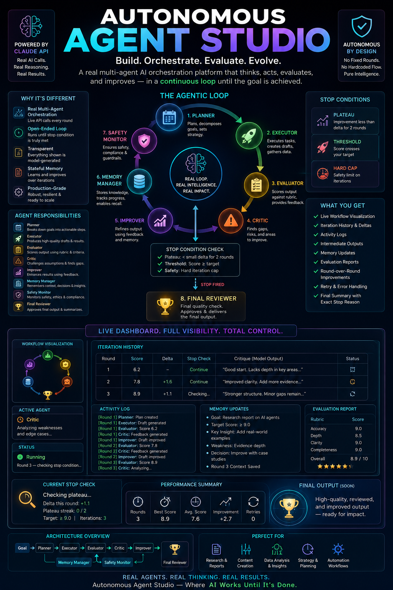

# Day 46 – Autonomous Agent Studio 🤖

## 📌 Challenge Overview

On Day 46 of the **ABTalks 60 Days Claude Challenge**, I explored the design of an **Autonomous Agent Studio**—a concept that demonstrates how multiple AI agents can collaborate in an iterative workflow to solve complex tasks.

Unlike traditional AI applications that rely on a single prompt-response interaction, this system is designed around a **continuous feedback loop** where specialized agents plan, execute, evaluate, critique, improve, and review outputs until a predefined stopping condition is met.

---

## 🎯 Objective

Build an intelligent multi-agent workflow capable of:

- Planning complex tasks
- Executing actions
- Evaluating generated results
- Identifying weaknesses
- Improving outputs iteratively
- Maintaining memory across iterations
- Monitoring safety and compliance
- Delivering a final reviewed response

---

## 🧠 AI Agents

The workflow consists of multiple specialized agents:

- 🗂️ Planner
- ⚙️ Executor
- 📊 Evaluator
- 🔍 Critic
- 🚀 Improver
- 💾 Memory Manager
- 🛡️ Safety Monitor
- ✅ Final Reviewer

Each agent has a dedicated responsibility, making the overall system modular, scalable, and easier to improve.

---

## 🔄 Iterative Workflow

Instead of stopping after one response, the system continuously cycles through:

Planner → Executor → Evaluator → Critic → Improver

After each iteration, the workflow checks whether it should:

- Continue improving
- Stop because the quality threshold has been reached
- Stop because improvements have plateaued
- Stop due to a safety iteration limit

Once a stopping condition is satisfied, the output is passed to the **Final Reviewer** for quality assurance.

---

## 📈 Dashboard Features

The Autonomous Agent Studio dashboard is designed to display:

- Live workflow visualization
- Active agent status
- Iteration history
- Activity logs
- Intermediate outputs
- Memory updates
- Evaluation reports
- Improvement tracking
- Retry count
- Final execution summary

---

## 💡 Key Learnings

Throughout this challenge, I gained a deeper understanding of:

- Multi-agent orchestration
- Agentic AI workflows
- Prompt engineering
- Autonomous decision-making
- Iterative optimization
- AI system architecture
- Feedback-driven execution
- Memory-aware AI agents

---

## 🚀 Future Improvements

Potential enhancements include:

- Long-term memory using vector databases
- Tool calling and API integrations
- Human-in-the-loop approvals
- Multi-model orchestration
- Parallel agent execution
- Cost and latency optimization
- Agent performance analytics
- Persistent workflow history

---

## 📷 Screenshots

### Poster

### Workflow Dashboard

### Agent Workflow

---

## 🎯 Reflection

Today's challenge reinforced an important idea:

> **The future of AI isn't just about smarter language models—it's about building intelligent systems where multiple specialized agents collaborate, evaluate, learn, and continuously improve together.**

Understanding how autonomous agents communicate, share memory, critique outputs, and iterate toward better solutions is a foundational step toward building next-generation AI applications.

---

## 🔥 Challenge Progress

**Day:** 46 / 60

**Challenge:** ABTalks 60 Days Claude Challenge

Learning one AI concept every day while building practical, real-world projects.