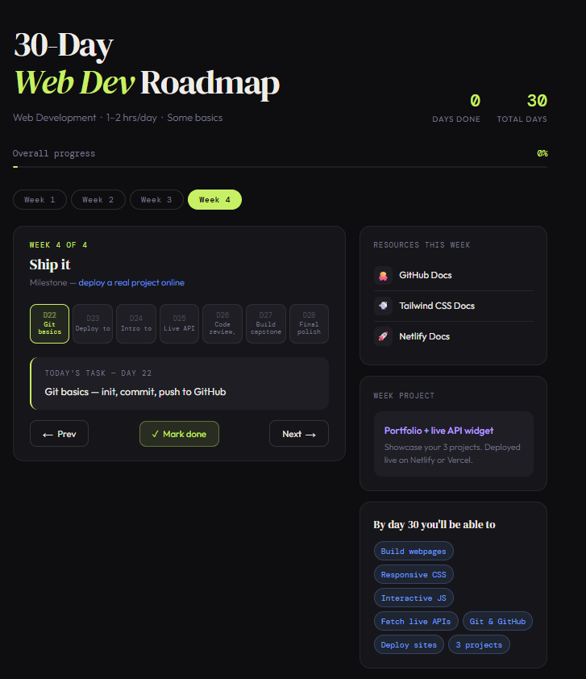
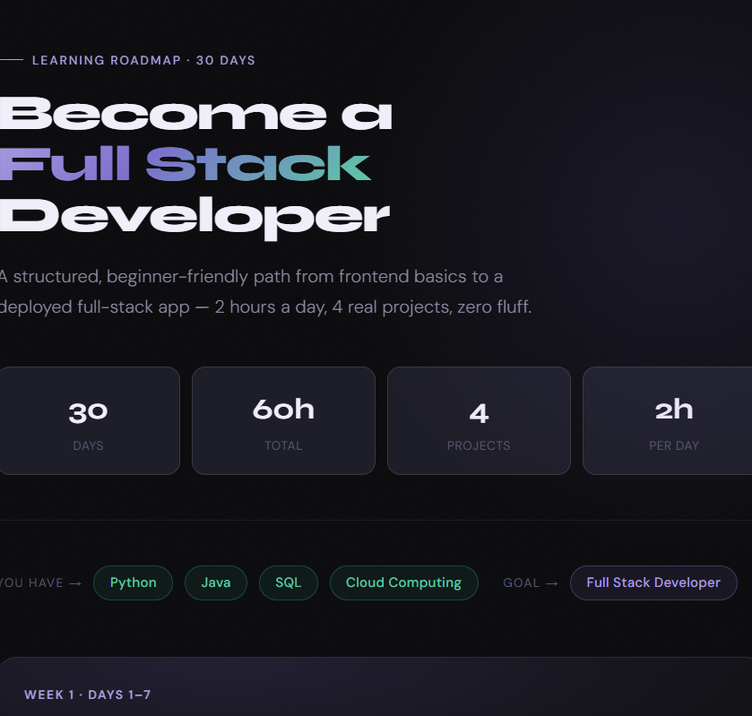

# Day 5 – The Power of Context in Prompt Engineering

## Objective

Understand how providing context changes the quality of AI-generated outputs by comparing two roadmap generations:

1. Roadmap generated without context
2. Roadmap generated with detailed context

---

# Prompt A – Without Context

## Prompt

```text
Create a 30-Day Web Development Roadmap.
```

## Output Summary

- Generic roadmap
- Standard learning sequence
- Common milestones
- Assumes all learners have the same background
- Limited personalization

## Screenshot



---

# Prompt B – With Context

## Prompt

```text
Create a 30-Day Full Stack Development Roadmap.

Current Skills:
- Python
- Java
- SQL
- Cloud Computing

Goal:
Become a Full Stack Developer

Daily Study Time:
2 hours/day

Experience:
Beginner in Web Development

Desired Outcome:
Build and deploy real projects
```

## Output Summary

- Personalized learning path
- Built around existing technical skills
- Frontend to backend progression
- Real-world project focus
- Deployment and portfolio building included
- Professional dashboard-style roadmap

## Screenshot



---

# Comparison

| Aspect | Prompt A (Without Context) | Prompt B (With Context) |
|----------|----------|----------|
| Personalization | Generic | Highly Personalized |
| Learning Path | Standard | Tailored to Existing Skills |
| Resources | General | Goal-Oriented |
| Projects | Basic | Real-World Portfolio Projects |
| Career Alignment | Moderate | Strong |
| Practicality | Average | High |
| Output Quality | Good | Excellent |

---

# Key Learnings

### 1. Context Improves Personalization

The roadmap generated with context was specifically designed around existing skills, goals, and available study time.

### 2. AI Performs Better With Relevant Information

Providing background details helped the AI generate a roadmap that was more useful and realistic.

### 3. Context Creates Better Learning Paths

Instead of treating every learner the same, the AI was able to build a customized progression.

### 4. Better Inputs Produce Better Outputs

The quality of the roadmap improved significantly when clear context was provided.

### 5. Context Engineering Matters

Adding relevant information such as skills, goals, constraints, and desired outcomes helps AI generate more accurate and practical results.

---

# Biggest Observation

The biggest difference between the two outputs was not the AI model itself but the amount of context provided.

The roadmap generated with context felt more relevant, actionable, and aligned with the learner's goals.

**Same AI + Better Context = Better Results**

---

# Files Included

- Prompt A Output Screenshot
- Prompt B Output Screenshot
- Comparison Analysis
- Key Learnings

---

# Conclusion

This exercise demonstrated how context directly impacts the quality of AI-generated responses. Providing clear background information, goals, and constraints allows AI to generate outputs that are more personalized, practical, and useful.

Day 5 reinforced an important Prompt Engineering principle:

> The quality of the output depends heavily on the quality of the context provided.