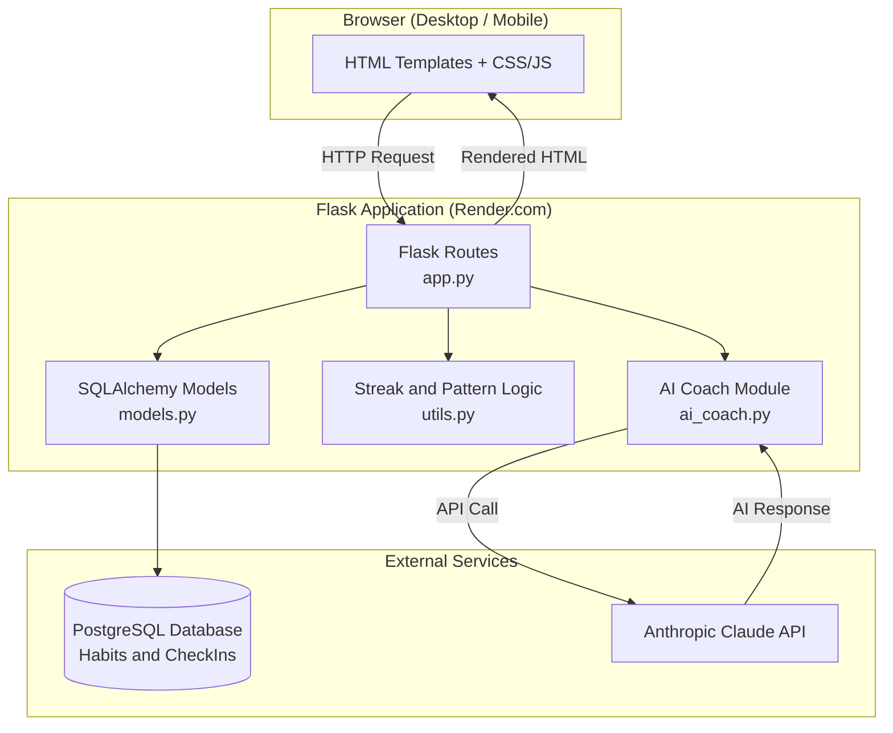
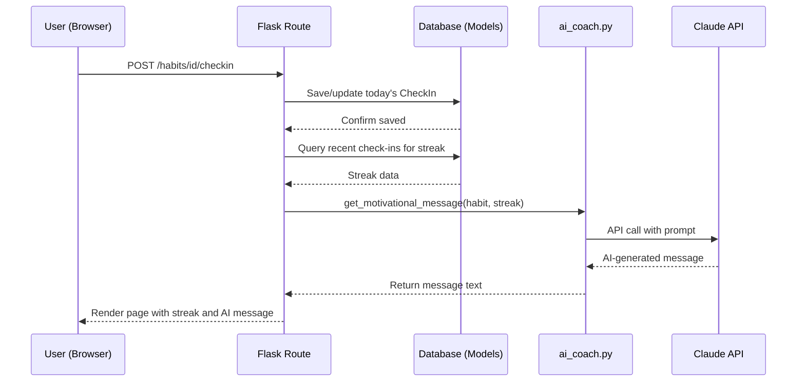
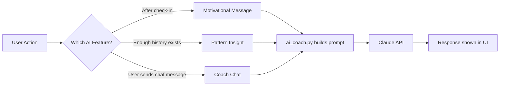

# AI Habit Coach — System Architecture

_Day 2 Deliverable — Source of truth for system design. Read alongside PRD.md and IMPLEMENTATION_BLUEPRINT.md._

## 1. Tech Stack (Finalized)

| Layer | Choice | Reasoning |
|---|---|---|
| Backend | Python + Flask | Lightweight, fast to build solo, fits 1–2 hr/day pace |
| Frontend | Jinja2 templates + vanilla CSS/JS | Ships with Flask, zero build step |
| Database | SQLite (dev) → PostgreSQL (prod) | Free, simple locally; real shared DB in production via SQLAlchemy (one-line config swap) |
| Authentication | None (v1.0) | Single-user mode per PRD — removes the biggest time/bug sink |
| AI | Anthropic Claude API (`anthropic` SDK) | Core requirement of the Claude AI Challenge; powers motivation, insights, chat |
| Hosting | Render.com (free tier) | Free web service + free Postgres, no credit card required |
| Other | python-dotenv, gunicorn, Git/GitHub | Standard, free, minimal |

## 2. Component Diagram

## 3. Request Lifecycle — Check-in → AI Motivation

## 4. AI Interaction Overview

## 5. Data Flow Summary

1. User interacts with a Flask route (check-in, add habit, send chat message).
2. Route reads/writes via SQLAlchemy models to the database.
3. For AI features, the route calls a function in `ai_coach.py`, which builds a context-aware prompt using real data from the database (habit name, streak, history) and calls the Claude API.
4. The Claude response is passed back into the rendered HTML template — never stored unless it's chat history (session-based, not persisted to DB in v1.0).
5. All API failures are caught with try/except and replaced with a graceful fallback message so the user experience never breaks.

## 6. External Services

- **Anthropic Claude API** — motivational messages, pattern insights, coach chat. Single point of AI integration via `ai_coach.py`.
- **Render.com** — hosts the Flask web service and the PostgreSQL database (free tier).
- **GitHub** — source control and deployment trigger (Render redeploys on push).

## 7. Notes / Deviations from Original Blueprint

- No architectural changes from the Day 1 Implementation Blueprint. This document makes the existing plan explicit and visual.
- One schema-level improvement identified (see SCHEMA.md): a unique constraint on `(habit_id, date)` in `CheckIn`, strengthening duplicate-check-in prevention beyond application-level logic alone.
