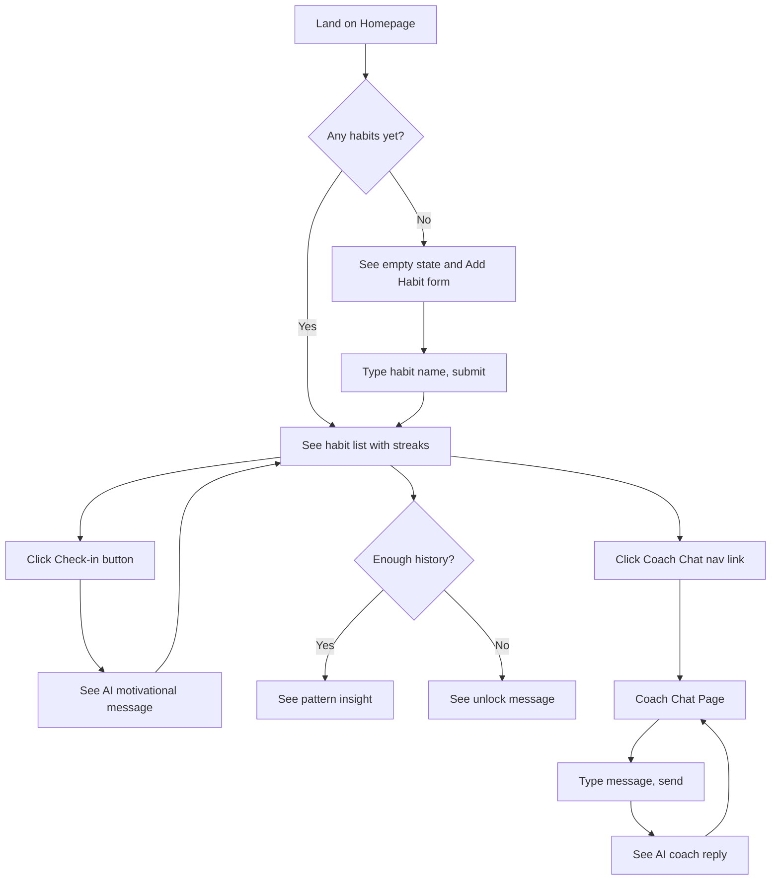

# AI Habit Coach — UI & User Flow

_Day 2 Deliverable. Two screens only, by design — matches PRD scope exactly._

## User Flow Diagram



## Screens (2 total — intentionally minimal)

1. **Homepage (`/`)** — habit list, add-habit form, check-in buttons, streaks, motivational messages, pattern insights.
2. **Coach Chat (`/coach`)** — simple message thread with a text input.

Every screen maps directly to an in-scope PRD feature. No screen exists "just in case."

## Low-Fidelity Wireframe — Homepage

```
+---------------------------------------+
|  AI Habit Coach            [Coach 💬] |   <- nav bar
+---------------------------------------+
|  + Add a new habit: [________] [Add]  |
+---------------------------------------+
|  🏃 Exercise            🔥 5 day streak|
|  [✓ Checked in today]      [Delete]   |
|  💬 "5 days strong — that's a real    |
|      rhythm forming!"                 |
|  📊 "You tend to miss Mondays..."     |
+---------------------------------------+
|  📖 Read                🔥 0 day streak|
|  [Check in]                 [Delete]  |
+---------------------------------------+
```

## Low-Fidelity Wireframe — Coach Chat

```
+---------------------------------------+
|  AI Habit Coach              [Home]   |
+---------------------------------------+
|  You: I skipped yesterday, feeling    |
|       discouraged                     |
|  Coach: That's okay — one day doesn't |
|       erase your progress...          |
+---------------------------------------+
|  [Type a message.............] [Send] |
+---------------------------------------+
```

## Navigation

Simple two-way nav bar link between Homepage and Coach Chat. No dead ends, no unreachable screens, no orphaned features.

## Responsive Notes (for Day 8 polish)

- Habit cards stack vertically on narrow (mobile) screens.
- Nav bar collapses to just icon + label on small screens if needed.
- Chat input stays pinned near the bottom of the viewport for easy thumb access on mobile.
