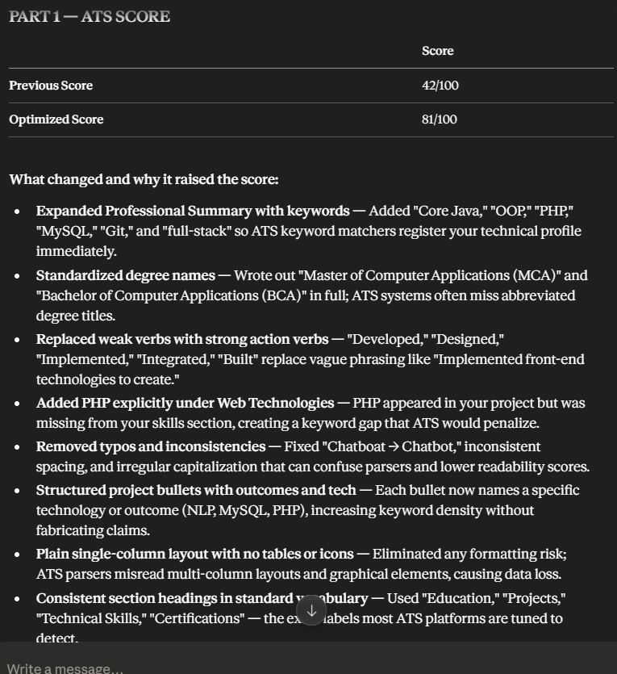
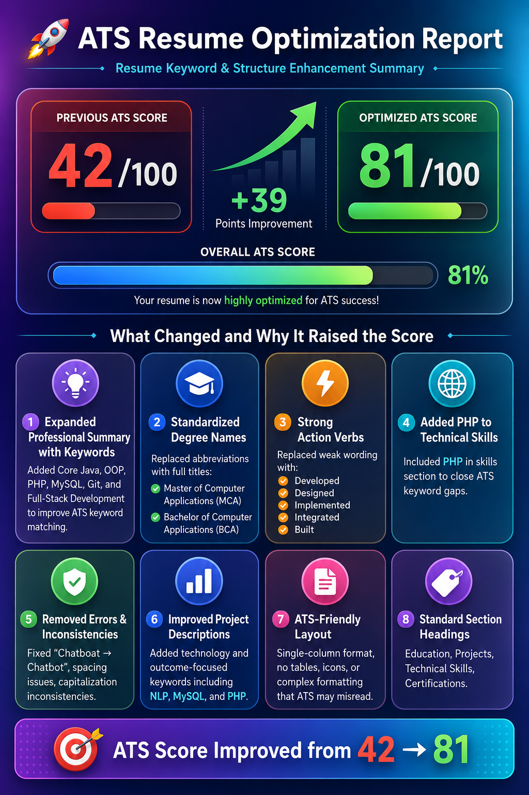
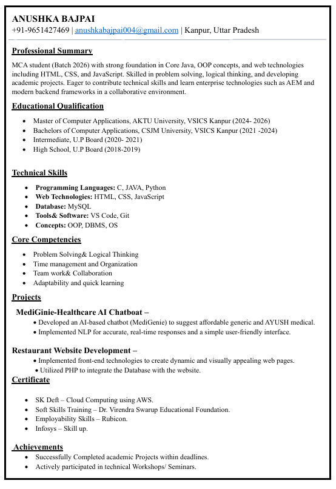
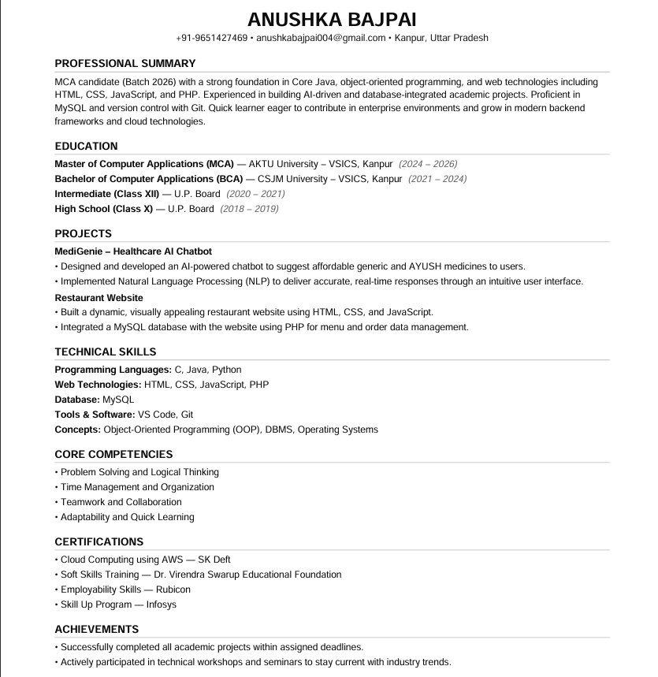

# Day 6 – ATS Resume Optimization Using Claude

## Objective

Learn how AI can be used to analyze and optimize a resume for Applicant Tracking Systems (ATS) and identify improvements that increase the chances of passing automated resume screening.

---

## Task Performed

Today I used Claude as an ATS Resume Reviewer.

I uploaded my resume and asked Claude to:

* Analyze my resume from an ATS perspective
* Identify weaknesses and missing keywords
* Suggest improvements in content and formatting
* Generate an optimized ATS-friendly version of my resume
* Estimate ATS scores before and after optimization

---

## ATS Analysis Results

| Metric              | Score      |
| ------------------- | ---------- |
| Previous ATS Score  | 42/100     |
| Optimized ATS Score | 81/100     |
| Improvement         | +39 Points |

---

## ATS Analysis Screenshot

### Original ATS Analysis

### ATS Optimization Report

---

## Key Improvements Suggested by Claude

### 1. Expanded Professional Summary

Added important technical keywords:

* Core Java
* Object-Oriented Programming (OOP)
* PHP
* MySQL
* Git
* Full-Stack Development

**Why it matters:** ATS systems search for relevant keywords that match job descriptions.

---

### 2. Standardized Degree Names

Changed:

* MCA → Master of Computer Applications
* BCA → Bachelor of Computer Applications

**Why it matters:** Full degree names are easier for ATS systems to recognize.

---

### 3. Stronger Action Verbs

Replaced weak wording with:

* Developed
* Designed
* Implemented
* Integrated
* Built

**Why it matters:** Action verbs make experience descriptions stronger and more professional.

---

### 4. Added Missing Technical Skills

Included PHP in the Technical Skills section.

**Why it matters:** Missing skills can reduce ATS matching scores.

---

### 5. Corrected Errors

Fixed:

* "Chatboat" → "Chatbot"
* Capitalization inconsistencies
* Spacing and formatting issues

---

### 6. Improved Project Descriptions

Added technology-specific and outcome-focused keywords including:

* NLP
* MySQL
* PHP

**Why it matters:** ATS systems reward detailed and technology-focused project descriptions.

---

### 7. ATS-Friendly Structure

Optimized the resume using:

* Single-column layout
* Standard formatting
* Clear section hierarchy

Avoided:

* Tables
* Multi-column layouts
* Complex graphics

---

### 8. Standard Section Headings

Used ATS-friendly headings:

* Professional Summary
* Education
* Projects
* Technical Skills
* Certifications

---

## Optimized Resume

### Before Optimization

### After Optimization

---

## Biggest Learning

The most important insight from this exercise was that having skills is not enough—those skills must be presented using the right keywords and structure so ATS software can recognize them.

My resume already contained relevant projects and technical knowledge, but several important keywords were either missing or not emphasized properly. Adding those keywords and improving formatting increased the ATS score from 42 to 81.

---

## Conclusion

This exercise demonstrated how AI tools like Claude can help job seekers identify resume weaknesses, improve keyword matching, strengthen content, and create ATS-friendly resumes.

Final Result:

**ATS Score Improved from 42/100 → 81/100 (+39 Points)**

---

## Tools Used

* Claude AI
* ATS Resume Analysis Prompting
* Resume Optimization Techniques

