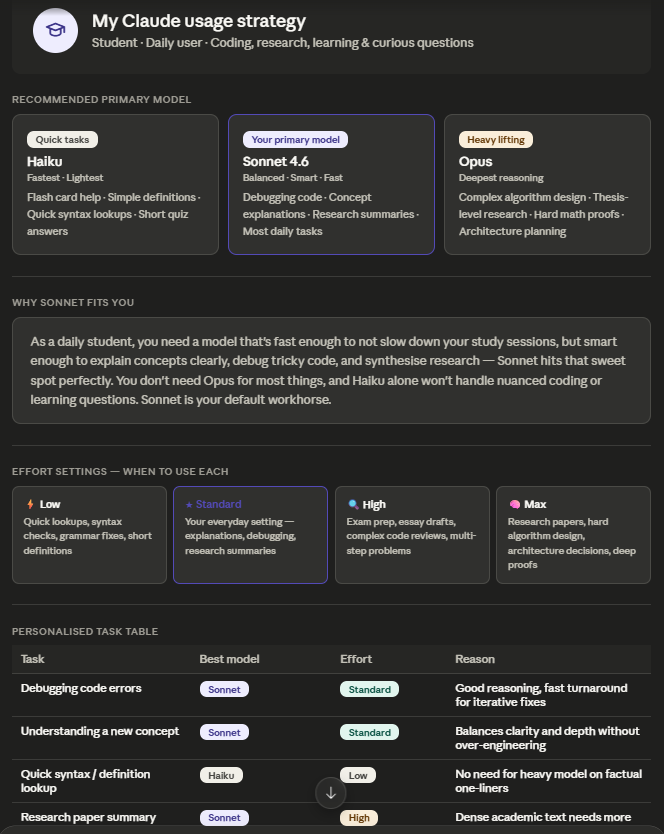
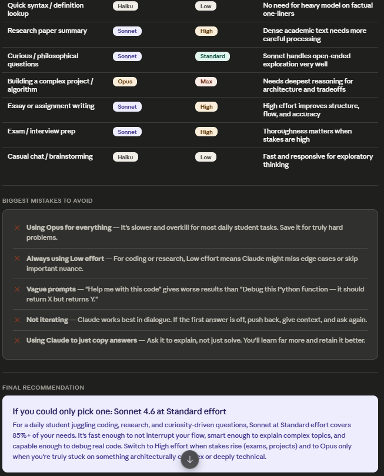
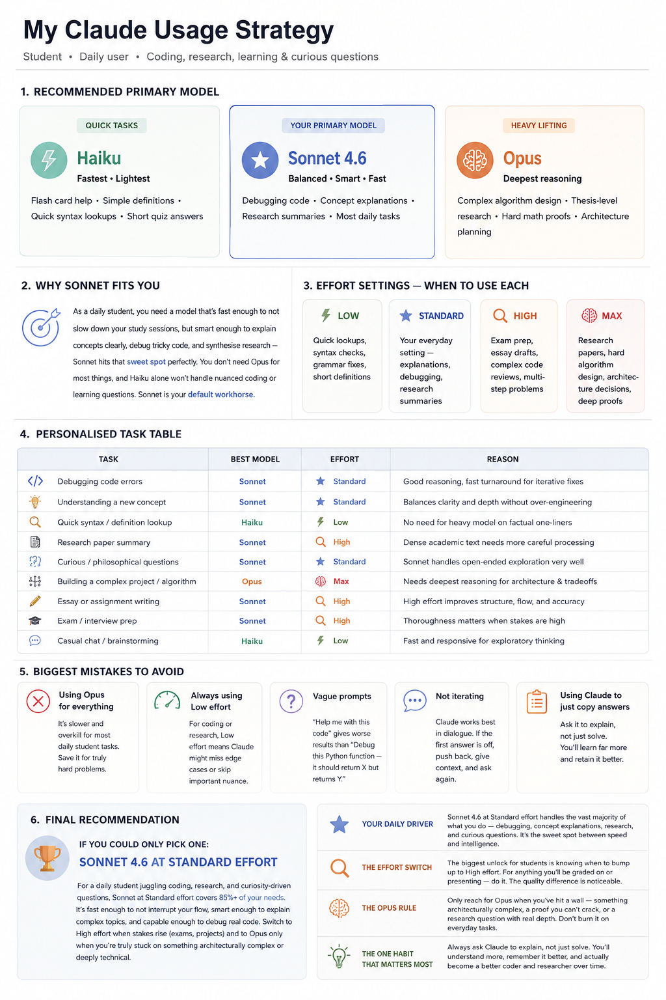

# Day 7 – Personalized Claude Usage Strategy

## Objective

The goal of this task was to create a personalized Claude usage strategy based on my profile as a student who regularly uses AI for coding, research, learning, exam preparation, and curiosity-driven exploration.

---

## My Profile

* Student
* Daily AI User
* Learning Programming & Software Development
* Uses AI for Research, Study, Coding, and Productivity
* Interested in understanding how to choose the right Claude model and effort level for different tasks

---

## Personalized Claude Strategy

### Recommended Primary Model

#### Haiku

**Best For:**

* Quick definitions
* Flashcard help
* Simple syntax lookups
* Short quiz answers

**Why?**
Fastest and lightest model for straightforward tasks.

---

#### Sonnet 4.6 (Primary Model)

**Best For:**

* Debugging code
* Learning new concepts
* Research summaries
* Assignment help
* Most daily tasks

**Why?**
Provides the best balance between speed, intelligence, and response quality.

---

#### Opus

**Best For:**

* Complex algorithms
* Architecture planning
* Deep research
* Advanced reasoning tasks

**Why?**
Offers the strongest reasoning capabilities for difficult and high-stakes problems.

---

## Effort Settings Guide

| Effort Level | Recommended Usage                                            |
| ------------ | ------------------------------------------------------------ |
| ⚡ Low        | Quick lookups, grammar fixes, definitions                    |
| ⭐ Standard   | Daily learning, coding, debugging, research summaries        |
| 🔍 High      | Exam preparation, assignments, code reviews                  |
| 🧠 Max       | Deep research, architecture design, advanced problem solving |

---

## Task-Based Recommendations

| Task                     | Model  | Effort   |
| ------------------------ | ------ | -------- |
| Debugging Code           | Sonnet | Standard |
| Learning New Concepts    | Sonnet | Standard |
| Quick Definitions        | Haiku  | Low      |
| Research Paper Summary   | Sonnet | High     |
| Essay Writing            | Sonnet | High     |
| Exam Preparation         | Sonnet | High     |
| Complex Project Planning | Opus   | Max      |
| Brainstorming            | Haiku  | Low      |

---

## Biggest Learnings

### 1. Sonnet is the Best Daily Driver

I learned that Sonnet provides the ideal balance between speed and reasoning. It can handle most student-related tasks efficiently without requiring the heavier Opus model.

### 2. Effort Settings Matter

Changing the effort level significantly impacts output quality. Using High effort for important tasks such as exams, assignments, and projects can improve results noticeably.

### 3. Use Opus Selectively

Opus should be reserved for genuinely difficult problems requiring deep reasoning instead of being used for everyday queries.

### 4. Context Improves Responses

Providing clear goals, constraints, and background information produces significantly better outputs compared to vague prompts.

### 5. Learning > Copying Answers

The most valuable use of Claude is asking for explanations and reasoning rather than simply requesting final answers.

---

## Screenshots

### Personalized Strategy Screenshot

### Visual Infographic

---

## Key Takeaways

* Sonnet 4.6 should be my default model for most daily work.
* Use Standard effort for everyday tasks.
* Increase to High effort for assignments and exam preparation.
* Use Opus only for complex technical challenges.
* Focus on understanding concepts rather than copying answers.
* Better prompts lead to better AI outputs.

---

## Conclusion

This exercise helped me understand how to use Claude more effectively based on task complexity and learning goals. Instead of using the same model and settings for every situation, I now have a structured strategy that helps maximize both productivity and learning outcomes.
