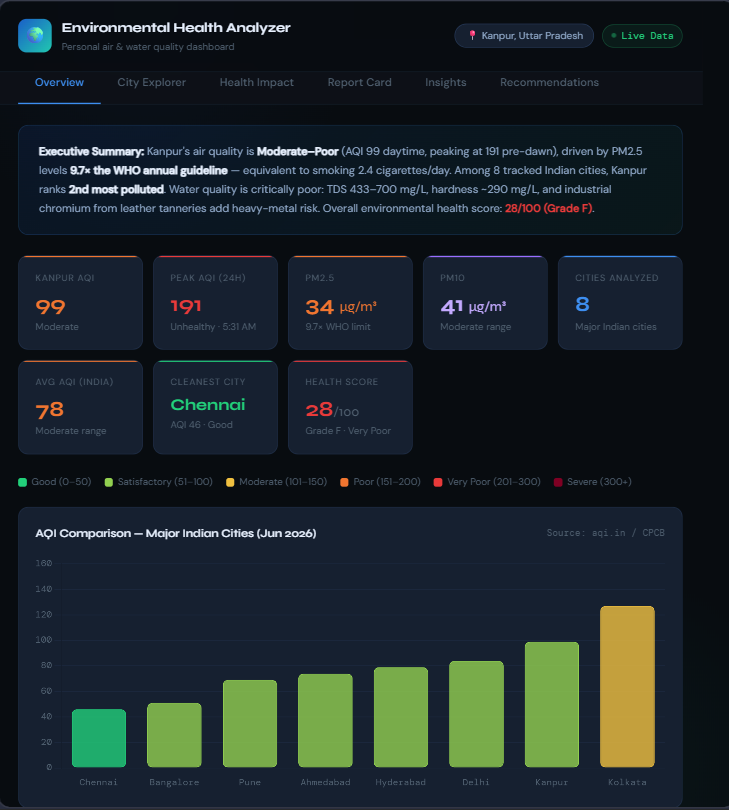
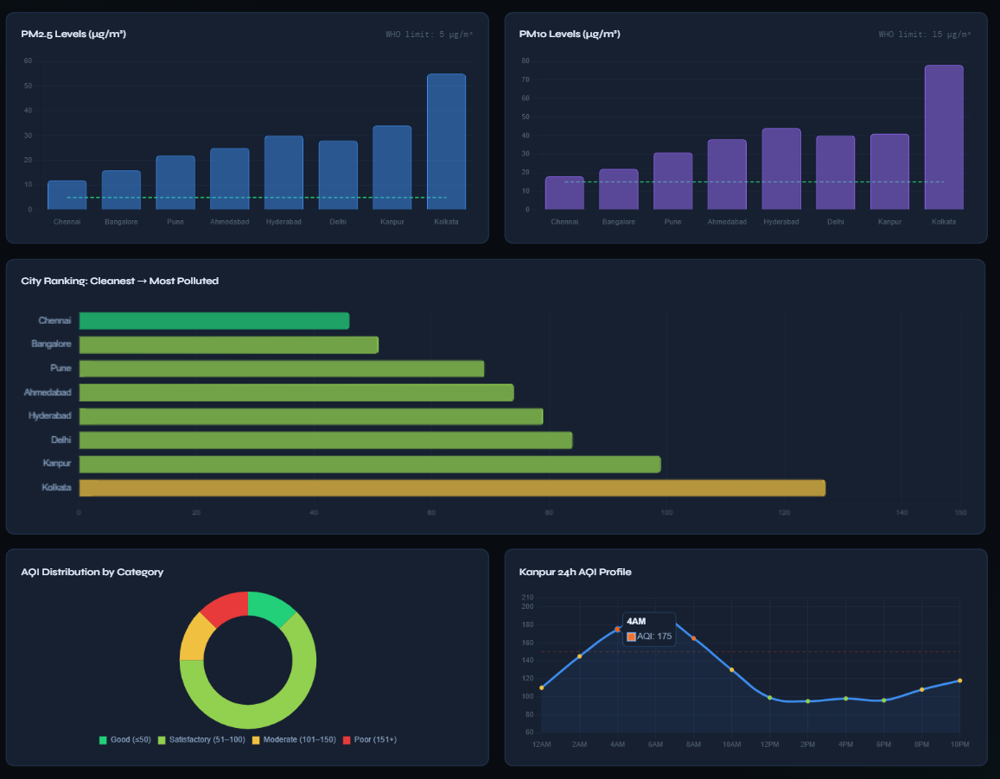
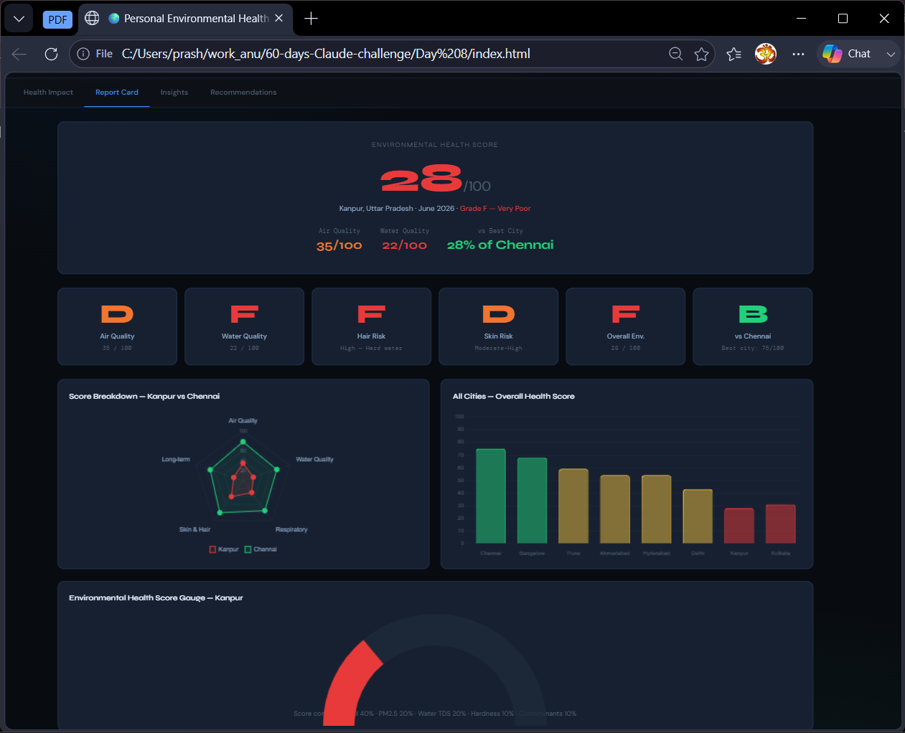
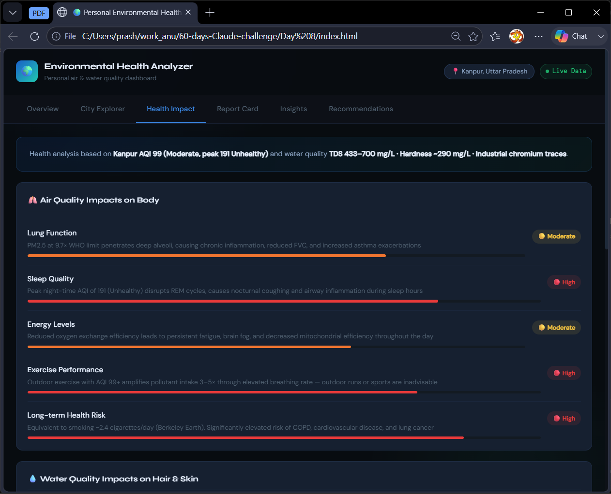
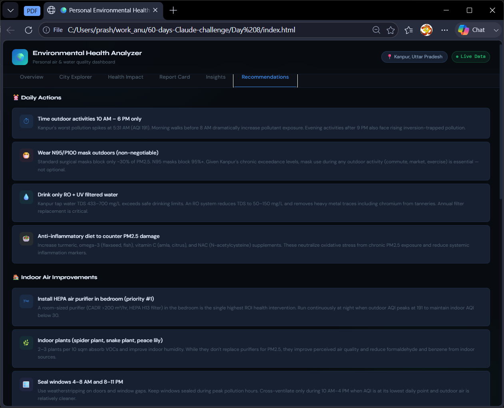

# Day 8 – Building a Personal Environmental Health Analyzer with Claude Artifacts

## Challenge Objective

For Day 8 of the 60 Days Claude challenge, the goal was to explore how Claude Artifacts can be used to transform a detailed prompt into a complete interactive application.

Instead of generating text-based outputs, I focused on creating a real-world dashboard that combines environmental data analysis with health insights.

---

## Project Overview

### 🌍 Personal Environmental Health Analyzer

An interactive dashboard designed to analyze environmental conditions and provide personalized health-related insights.

The application evaluates:

* Air Quality Index (AQI)
* PM2.5 Levels
* PM10 Levels
* Water Quality Indicators
* Environmental Health Scores
* Health Risk Assessments

The dashboard presents data through interactive visualizations, filters, rankings, and recommendation systems.

---

## Features Implemented

### 📊 Environmental Analytics

* AQI Analysis
* PM2.5 Monitoring
* PM10 Monitoring
* City Rankings
* Environmental Health Score Calculation

### 📈 Interactive Dashboard

* Key Metrics Panel
* AQI Comparison Charts
* PM2.5 & PM10 Visualizations
* City Comparison Mode
* Interactive Filters

### 🚦 Health Assessment

* Air Quality Risk Indicators
* Water Quality Assessment
* Hair Health Risk Analysis
* Skin Health Risk Analysis
* Environmental Wellness Scorecard

### 💡 Personalized Recommendations

* Daily Environmental Tips
* Indoor Air Improvement Suggestions
* Outdoor Activity Guidance
* Hair Care Recommendations
* Skin Care Recommendations

---

## Dashboard Screenshots

### Main Dashboard





### Analytics & Charts

Insert Screenshot Here




### Health Insights Panel



### Recommendations Section




---

## Generated HTML Application

The complete application was generated using Claude Artifacts and saved as:

```text
index.html
```

### File Included

```text
Day8/
│
├── day8.md
├── index.html
├── screenshots/
│   ├── dashboard.png
│   ├── dashboard2.png
│   ├── charts.png
│   ├── health.png
│   └── recommendation.png
```

---

## Key Insights

### Insight 1

A well-structured prompt can generate an entire dashboard application, not just code snippets.

### Insight 2

Providing multiple expert roles (Data Analyst, Environmental Researcher, UX Designer, Frontend Developer) significantly improves the quality of generated outputs.

### Insight 3

Claude can combine data analysis, UI design, and application development into a single workflow.

### Insight 4

Interactive dashboards can be created from natural language requirements without manually writing frontend code.

### Insight 5

Prompt engineering is becoming increasingly similar to product design and requirement gathering.

---

## Biggest Learning

The most valuable lesson from this project was realizing that AI is no longer limited to content generation.

By clearly describing a problem, desired functionality, user experience, and expected outputs, it is possible to generate complete software solutions using natural language.

The quality of the result depends heavily on the clarity and structure of the prompt.

---

## Challenges Faced

* Defining detailed dashboard requirements
* Structuring multiple analysis components in one prompt
* Balancing data analysis with UI requirements
* Ensuring health insights remained meaningful and actionable

---

## What I Learned About Claude Artifacts

* Claude Artifacts can generate complete web applications.
* Detailed prompts produce significantly better results.
* Role-based prompting improves output quality.
* Interactive dashboards can be built without manually coding every component.
* AI can accelerate the journey from idea to prototype.

---

## Conclusion

Day 8 demonstrated how AI can move beyond content creation and assist in building practical software solutions.

The Personal Environmental Health Analyzer showed how a detailed prompt can be transformed into a fully functional dashboard that combines analytics, visualization, health insights, and personalized recommendations.

This challenge reinforced the importance of prompt engineering, requirement specification, and AI-assisted application development.
