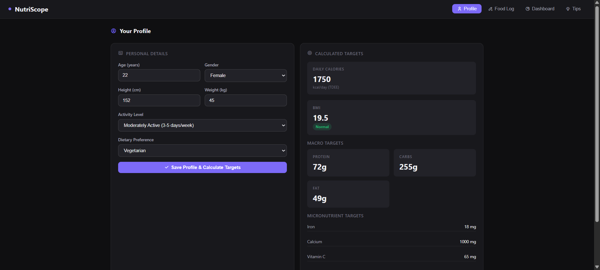
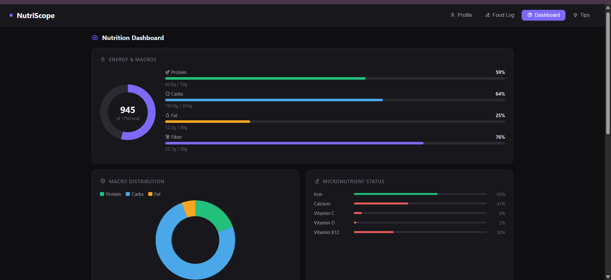
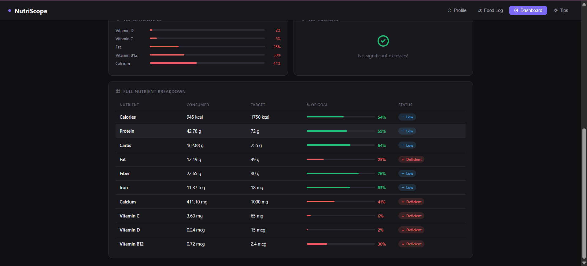
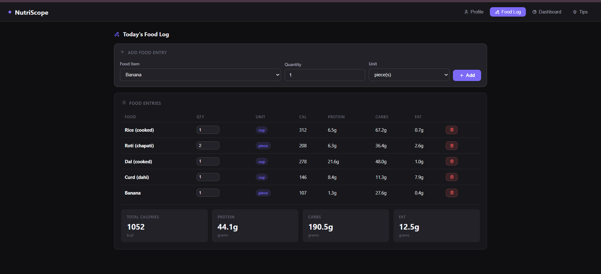
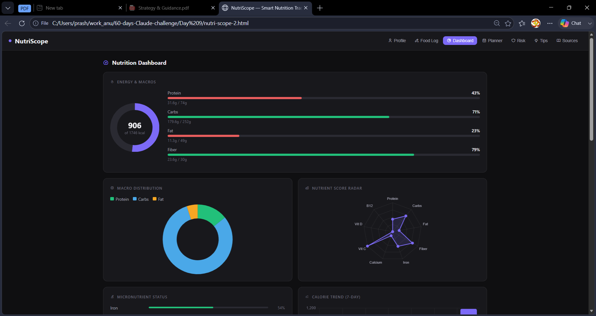
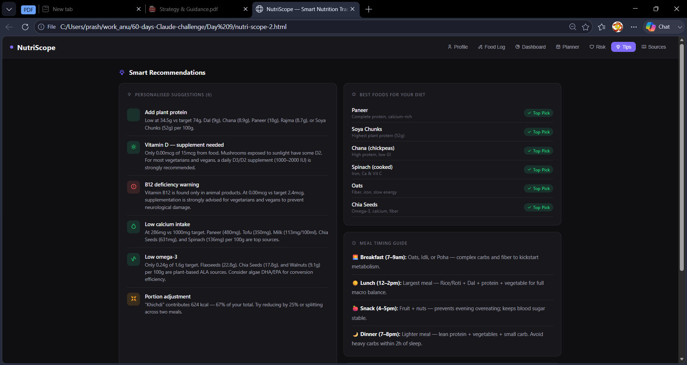
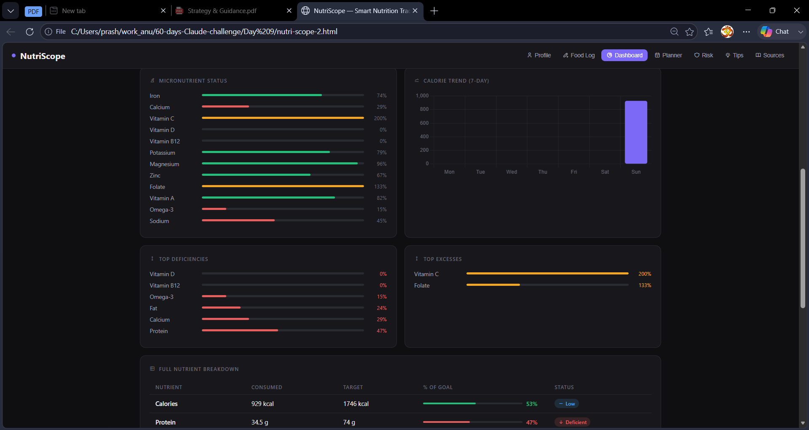
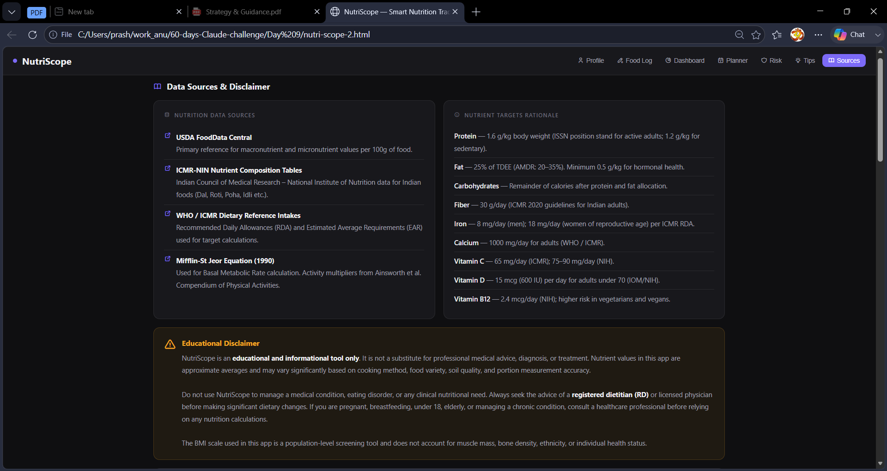

# Day 9 – NutriScope: From MVP to Enhanced Application

## Objective

Build an MVP of a nutrition analysis application and then improve it by adding new features, better visualizations, and a more structured user experience using Claude.

---

## Project Overview

**NutriScope** is a Smart Nutrition Analyzer that helps users track nutritional intake, monitor macronutrients and micronutrients, and gain insights through visual dashboards.

**Technologies Used:**

* HTML
* CSS
* JavaScript
* Chart.js
* Claude AI

---

# Version 1 – MVP

### Screenshot

### Features

* Nutrition Dashboard
* Energy & Macro Tracking
* Macro Distribution Chart
* Micronutrient Status
* Simple Navigation (4 Tabs)

  * Profile
  * Food Log
  * Dashboard
  * Tips

### Generated File

`nutri-scope.html`

---

# Version 2 – Enhanced Application

### Screenshot

### Features Added

* Planner Module
* Risk Assessment Module
* Sources Section
* Nutrient Score Radar Chart
* 7-Day Calorie Trend Analysis
* Improved Dashboard Layout
* Enhanced Navigation (6 Tabs)
* Better Nutrition Insights

### Generated File

`nutri-scope-2.html`

---

# Comparison: MVP vs Enhanced Version

| Feature                | MVP   | Enhanced |
| ---------------------- | ----- | -------- |
| Dashboard              | ✅     | ✅        |
| Macro Tracking         | ✅     | ✅        |
| Micronutrient Tracking | ✅     | ✅        |
| Planner                | ❌     | ✅        |
| Risk Assessment        | ❌     | ✅        |
| Sources Section        | ❌     | ✅        |
| Radar Chart            | ❌     | ✅        |
| Calorie Trend Analysis | ❌     | ✅        |
| Navigation Tabs        | 4     | 6        |
| User Experience        | Basic | Improved |

---

# What Changed?

The MVP focused on solving the core problem of nutrition tracking and visualization.

The enhanced version expanded the application into a more complete nutrition platform by adding planning tools, risk analysis, data sources, advanced charts, and improved navigation.

These changes made the application more informative, interactive, and user-friendly.

---

# Key Learnings

* Iterative development improves application quality significantly.
* An MVP is only the starting point of product development.
* Claude can help generate initial solutions as well as suggest meaningful improvements.
* Better prompts lead to better feature ideas and UI enhancements.
* Visual analytics such as radar charts and trend charts improve data interpretation.
* Comparing multiple versions helps identify opportunities for refinement and optimization.

---

# Conclusion

This challenge demonstrated how an application can evolve from a simple MVP into a more feature-rich product through iterative improvements and AI-assisted development. Building both versions of NutriScope helped me understand the importance of continuous enhancement, user experience, and prompt-driven development.

#60DayClaudeChallenge 
