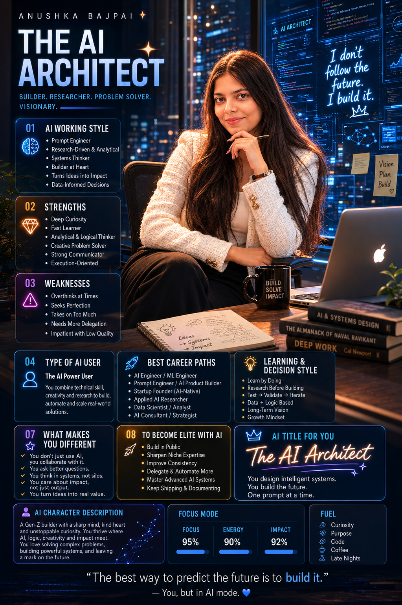

# 🚀 60 Days Claude Challenge

## 👋 About Me

Hi, I'm **Anushka Bajpai**.

I am an MCA graduate with a strong interest in Software Development, Artificial Intelligence, Problem Solving, and Continuous Learning.

I am starting this **60 Days Claude Challenge** to improve my AI skills, explore prompt engineering, build practical projects, and document my learning journey publicly.

---

# 🎯 Goals for the Next 60 Days

My goals for this challenge are:

* Improve my prompt engineering skills
* Learn advanced AI workflows
* Build practical AI-powered projects
* Explore automation and productivity systems
* Learn in public and document my progress
* Develop a strong AI portfolio
* Become a better software engineer and problem solver

---

# 🤖 My AI Personality Profile

## AI Title

### The AI Architect

Builder • Researcher • Problem Solver • Continuous Learner

---

## AI Working Style

* Research-driven
* Curious and detail-oriented
* Learns by experimentation
* Uses AI as a thinking partner
* Focuses on understanding concepts deeply
* Prefers practical learning through projects

---

## Strengths

* Strong curiosity
* Analytical thinking
* Fast learner
* Persistence and consistency
* Good problem-solving approach
* Willingness to explore new technologies

---

## Areas for Improvement

* Avoid overthinking
* Improve execution speed
* Focus on fewer priorities at a time
* Build more projects consistently

---

## Future Career Paths

* Software Engineer
* AI Engineer
* Prompt Engineer
* AI Product Builder
* Machine Learning Engineer
* Technical Consultant

---

# 🎬 Cinematic AI Portrait

---

# 📚 Topics I Will Explore

* Claude AI
* Prompt Engineering
* Software Development
* AI Tools
* Automation
* Productivity Systems
* Generative AI
* Real-World AI Applications

---

# 📅 Challenge Progress

| Day    | Status              |
| ------ | ------------------- |
| Day 01 | ✅ Started Challenge |
| Day 02 | ⏳                   |
| Day 03 | ⏳                   |
| Day 04 | ⏳                   |
| Day 05 | ⏳                   |
| ...    | ...                 |
| Day 60 | 🎯 Goal             |

---

## Why This Challenge Matters

I believe consistency creates growth.

This challenge is an opportunity to learn new technologies, improve my AI skills, build useful projects, and create a public record of my progress over the next 60 days.

---

*"Consistency beats intensity. One day at a time."* 🚀
